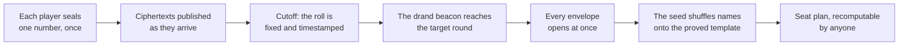

<div align="center">

# Randomised Mahjong Seating

**A seating draw for twelve players that nobody can predict, nobody can steer, and anybody can check afterwards — including the person running it.**

[](LICENSE)
[](package.json)
[](test/)
[](package.json)
[](https://drand.love)

English · [简体中文](README.zh.md)

</div>

---

Twelve players are seated across eleven rounds at three tables of four. The seating
*template* — who sits with whom, in which wind, at which table — is fixed and provably
optimal. Which player lands on which position in that template is decided by a draw that
all twelve contribute to, that opens itself at a pre-announced moment, and that can be
recomputed from published data by anyone who cares to.

The two halves are independent and both are finished: the combinatorics is solved to
proven optimality, and the draw is a working web application with a documented protocol,
an operational runbook and an end-to-end rehearsal you can run in three minutes.

**Contents** — [How it works](#how-it-works) · [Guarantees](#guarantees) ·
[Quick start](#quick-start) · [Documentation](#documentation) ·
[Running it](#running-it) · [Project status](#project-status) ·
[Repository layout](#repository-layout) · [Hard rules](#hard-rules) ·
[License](#license)

## How it works



Each player picks a whole number between 0 and 255. Their browser mixes it with sixteen
random bytes it generates itself and seals the result with **timelock encryption** against
a future [drand](https://drand.love) beacon round — so the ciphertext becomes readable at a
moment fixed in advance and not one second earlier. There is no key holder to bribe,
subpoena or trust: opening early is not forbidden, it is infeasible.

Every ciphertext is published, with a third party's timestamp, the moment it arrives.
At the cutoff the list of who took part is fixed, digested, and anchored into Bitcoin
through [OpenTimestamps](https://opentimestamps.org) — while the beacon that would open any
of it still does not exist. When the target round lands, all twelve envelopes open at
once, the numbers fold into one seed, and the seed permutes the twelve names onto the
template.

For the full argument from first principles, with figures, read
**[`docs/seating-design.md`](docs/seating-design.md)**. It is not only documentation: the
build renders it, and its Chinese translation, into the application itself, so the page a
player opens from the header is the document in this repository rather than a summary that
can drift from it.

## Guarantees

|  | How it is obtained |
|---|---|
| **Uniform** | Every one of the 479,001,600 assignments is equally likely. |
| **Unpredictable** | One honest contribution is enough. No majority is required, and the beacon is folded in on top. |
| **Unbiasable** | At the moment anyone submits, every other submission is still sealed. The information needed to choose a favourable number does not exist yet — for anybody, the organiser included. |
| **Unstallable** | Opening is not an action any participant performs, so refusing to open is not available. |
| **Verifiable** | The sealed ciphertexts, the beacon signature, the shuffling code and the template are all public. `node generate.js --verify results.json` recomputes every byte. |
| **Trust-free** | None of the above rests on believing that a particular person behaved honestly. |

The seating template itself is not a heuristic. Every pair of players shares a table
exactly three times; every position's wind split is exactly {3,3,3,2}; every pair sits
opposite exactly once; 55 of the 66 rivalries are perfectly balanced. Those figures are
**globally optimal and proved** — the integer programmes terminated with objective equal to
bound, over all five non-isomorphic resolvable 2-(12,4,3) designs known to exist, exactly
one of which admits the "opposite once" condition. The design is not chosen; it is forced.

## Quick start

```sh
git clone <this repository> && cd mahjong-random-seating
npm ci
npm test                  # 313 unit tests, fully offline, ~12 s
npm run rehearse          # RUNBOOK B/C/D end to end in a sandbox, ~3 min
```

`npm run rehearse` is the fastest way to see the whole thing work. It builds a throwaway
git repository, snapshots a roster, freezes and tags it, seals twelve real ciphertexts
against a genuine drand round three minutes away, runs the draw, syncs the seat plan, and
performs the check a player does afterwards. Nothing is simulated except Pantheon.

## Documentation

| Document | What it covers | 中文 |
|---|---|---|
| [`docs/seating-design.md`](docs/seating-design.md) | Where the seating chart came from: the wish list, the two impossibility theorems, the solver, and why a proved-optimal chart still needs a lottery. No mathematical background assumed. | [中文](docs/seating-design.zh.md) |
| [`docs/PROTOCOL.md`](docs/PROTOCOL.md) | The protocol itself: frozen artefacts, the byte encoding, the API, quorum and failure handling, the trust boundary. **Read this before changing code.** | [中文](docs/PROTOCOL.zh.md) |
| [`docs/UI-SPEC.md`](docs/UI-SPEC.md) | The player-facing flow, stage by stage, and the rules that make it honest. | [中文](docs/UI-SPEC.zh.md) |
| [`docs/PANTHEON-INTEGRATION.md`](docs/PANTHEON-INTEGRATION.md) | Sign-in through Frey, the seat-plan prescript through Mimir, and what the wire actually looks like. | [中文](docs/PANTHEON-INTEGRATION.zh.md) |
| [`docs/RUNBOOK.md`](docs/RUNBOOK.md) | The operator's checklist, in order: implementation, freeze, submission window, draw, and what to do when something goes wrong. | [中文](docs/RUNBOOK.zh.md) |
| [`docs/IMPLEMENTATION_NOTES.md`](docs/IMPLEMENTATION_NOTES.md) | Every decision the specification left open, every deviation from it, the bugs worth knowing about, and a table of what has actually been verified. | [中文](docs/IMPLEMENTATION_NOTES.zh.md) |
| [`deploy/README.md`](deploy/README.md) | Putting it on a server: install, environment, the one process, the reverse proxy, TLS, and the pre-flight before you publish the URL. | [中文](deploy/README.zh.md) |

## Running it

### The checks, which need no configuration

```sh
npm ci
npm test                  # 313 unit tests, offline, ~12 s
npm run verify-template   # re-derives every invariant of the frozen template
npm run e2e               # RUNBOOK A2-A7 against live drand, ~90 s
npm run rehearse          # RUNBOOK B/C/D end to end in a sandbox, ~3 min
```

[`.github/workflows/reproducibility.yml`](.github/workflows/reproducibility.yml) runs the
first three on every push, on Linux and on Windows with `core.autocrlf=true`, plus
`build-client.js --check` — the rebuild from source that `--verify-hash` cannot stand in
for, because it needs esbuild. It runs them on a clone nobody has touched, which is the
point: the checkout bug in [`docs/IMPLEMENTATION_NOTES.md`](docs/IMPLEMENTATION_NOTES.md)
§6d could not appear in the tree where the files were written. `e2e` is not in it — live
drand, three minutes.

### Development

The app needs `data/protocol.json` and `data/roster.json` and refuses to start without
them. Renaming the `.example` files does not work and is not meant to: the placeholder
`target_round: 0` and `pantheon_event_id: 0` are both rejected, so a run cannot be started
against values nobody chose.

```sh
cp data/protocol.example.json data/protocol.json
node tools/pick-round.js --in 2h --write        # target_round, cutoff and reveal gap together
node tools/freeze.js --event 42 --write         # data/roster.json, read out of Pantheon
npm run build                                   # rebuild public/app.js + app.css
PANTHEON_MODE=stub npm run serve                # http://127.0.0.1:8080
```

> [!IMPORTANT]
> **Nobody types the roster by hand.** `tools/freeze.js --event <id> --write` reads the
> event's registrations from Pantheon and writes the twelve `{local_id, person_id, title}`
> rows itself, leaving out anyone marked `ignore_seating`. It refuses to write anything at
> all if a player has no `local_id` — the failure that otherwise surfaces after the draw,
> in the seat-plan sync, when nothing can be changed. Without `--write` it says what it
> would do and touches nothing. This is RUNBOOK step 10, and it is the only supported way
> to produce that file.

It needs a Pantheon to read, which in development means one of three things:

- **A real instance** — `PANTHEON_MODE=twirp` plus the base URLs and admin credentials
  from [`deploy/README.md`](deploy/README.md) §2. `tools/pantheon-fixture.js --accounts`
  builds a test event there, twelve accounts and all.
- **No Pantheon at all** — `PANTHEON_MODE=stub` with `PANTHEON_STUB_ROSTER` pointing at a
  small JSON file of registrations. The stub deliberately will not seed itself from
  `roster.json`: a fake that agreed with the file step 10 is supposed to write could not
  exercise step 10 at all.
- **Neither, yet** — `npm run rehearse` does the whole of B, C and D in a throwaway
  repository, including this step and its refusals.

<details>
<summary><b>Choosing a port, the admin dashboard, and <code>runtime.json</code></b></summary>

<br>

8080 is the default and is often taken, particularly on a box that also runs Pantheon.
Either form works, and the flag wins:

```sh
node server/server.js --port 9000
PORT=9000 npm run serve
```

`--host` moves the interface the same way; it stays on loopback unless you say otherwise,
because in production something else terminates TLS in front of it. A port already in use
is reported as that, with the flag to use instead, rather than as a stack trace.

`PANTHEON_MODE=stub` runs against the in-process fake, which is what makes the whole flow
exercisable without a Pantheon deployment. It also enables a development-only sign-in
stand-in that is refused under `NODE_ENV=production`.

Set `ADMIN_TOKEN` to put the organiser's dashboard on `/admin?token=…`: submission
progress and who is still missing, the pre-flight checks, the frozen artefacts'
fingerprints, whether the draw job is running, the result, the Pantheon sync, and every
past attempt. It is read-only, and without `ADMIN_TOKEN` the route does not exist at all.

```sh
ADMIN_TOKEN=$(openssl rand -hex 16) PANTHEON_MODE=stub npm run serve
```

`data/runtime.json` is optional. Copy `runtime.example.json` to it only to change
something — a different drand mirror, real Pantheon base URLs — and note that it is
gitignored, because it is deliberately outside the freeze
([`docs/PROTOCOL.md`](docs/PROTOCOL.md) §4.2).

</details>

### Production

One process, and it draws as well as serves:

```sh
node server/server.js
```

There is nothing else to install and no root needed. The server spawns
`server/finalise.js` on a timer of its own (`server.finalise_interval_seconds`, default
60), so the draw happens without a systemd unit or a cron entry — and if you would rather
schedule it yourself, `server.run_finalise: false` hands it back.

Everything else about a real deployment — the frozen checkout, the `.env`, the reverse
proxy and TLS, keeping the one process alive on Linux or Windows, and how you find out if
nothing is drawing — is in **[`deploy/README.md`](deploy/README.md)**.

Three differences from the development commands above are worth stating here, because each
is a way to be accidentally running a test as if it were the real thing:

| | development | production |
|---|---|---|
| `NODE_ENV` | unset | `production` — marks the session cookie `Secure` and makes `/api/dev-authorize` return 404 |
| `PANTHEON_MODE` | `stub` | `twirp`, against the instance the players actually have accounts on |
| the freeze | whatever is in the tree | a checkout at the tag from RUNBOOK step 11, with `--verify-hash` passing |

`/admin` says all three out loud in its pre-flight panel, and refuses to call a deployment
ready while any of them is wrong.

```sh
node tools/freeze.js                            # RUNBOOK 8-11, checks only
node tools/freeze.js --write --tag frozen-v1    # ...and commit and tag
```

## Project status

| Area | State |
|---|---|
| The seating template and its proofs | **done and verified** — globally optimal, re-derivable by `tools/verify_template.py` |
| `generate.js` and the byte encoding | **done** — cross-checked by an independent Python implementation |
| The player application | **done** — all stages, both languages, phone included ([`docs/UI-SPEC.md`](docs/UI-SPEC.md)) |
| The backend, the draw job and its scheduler | **done** — one process, no root, no cron |
| Pantheon integration | **done, and run against a real instance** — see below |
| The operational runbook | **rehearsed, not performed** |
| A draw for people who did not know it was a test | **not yet** |

<details>
<summary><b>What "run against a real instance" does and does not mean</b></summary>

<br>

The Twirp client has been run against a real Pantheon (`cdda3fc`, in Docker under WSL 2),
twice: once against a borrowed event, and once end to end against a fresh one where all
twelve players signed in with an email and a password
(`tools/pantheon-fixture.js --accounts`), sealed real ciphertexts, and had the resulting
seat plan read back out of Pantheon seat by seat. Nine things were wrong across the two
rounds and not one of them failed loudly — see
[`docs/PANTHEON-INTEGRATION.md`](docs/PANTHEON-INTEGRATION.md) §2, §3, §5.1 and §6.

Three are worth knowing before you deploy: Frey needs **two** addresses, because the
browser calls it as well as the backend; a sign-in that fails for any reason used to be
reported to the player as a wrong password; and `MakePrescriptedSeating` randomises the
winds unless the caller states the mode, which Forseti does and a script might not.

What is still outstanding is narrower: **the instance you actually deploy against**.
Pantheon moves, §5.1 is a fact about one commit, and the fixture plus §6 make re-checking
it a half-hour job rather than a research project.

</details>

<details>
<summary><b>What "rehearsed, not performed" means</b></summary>

<br>

`npm run rehearse` runs sections B, C and D of the runbook end to end in a throwaway
repository — roster snapshot, freeze, tag, twelve sealed submissions, the chase list, the
draw, the sync, and the check a player does afterwards — against the Pantheon stub and a
real drand round. Every step passes. What is left is doing it for an actual event, with
real registrations and a deployment, and with the stub replaced by a real instance.

The last row of the table is the only item that cannot be closed by writing more code.

</details>

> [!WARNING]
> Read [`docs/IMPLEMENTATION_NOTES.md`](docs/IMPLEMENTATION_NOTES.md) before freezing, and
> [`docs/PROTOCOL.md`](docs/PROTOCOL.md) end to end before changing code — particularly §7
> (the algorithm) and §8 (quorum and failure handling). The rules there are where the
> fairness comes from, and they should not be rewritten to whatever seems more reasonable
> in the moment.

## Repository layout

```
generate.js                  # PROTOCOL.md §7 — frozen; node:crypto only, no dependencies
data/
  schedule_template.json     # frozen and verified — do not hand-edit
  roster.example.json        # shape reference; the real one is written by tools/freeze.js
  protocol.example.json      # FROZEN parameters: chain, target round, quorum, input range
  runtime.example.json       # operational settings — not frozen, not tagged, optional
                             # protocol.json and roster.json are gitignored here: they are
                             # one event's data, frozen in the tree that event is run from
server/
  server.js                  # the six endpoints of §6, plus the SSE stream
  finalise.js                # the draw job and the Pantheon sync (§5, §8) — a separate
                             # process, run on a timer by schedule.js
                             # idempotent: never re-draws, never un-publishes a result
  schedule.js                # the timer that runs finalise.js, so no cron or systemd is needed
  rounds.js                  # voided attempts: archive, verify, and open the next one
  admin.js                   # the organiser's read-only dashboard (RUNBOOK C/D)
  pantheon.js                # the Pantheon boundary: Twirp client + in-process stub
  config.js                  # loads and validates the frozen artefacts; refuses to start otherwise
  runtime.js                 # the other half: operational settings and their defaults (§4.2)
  ciphertext.js              # admission checks — is this addressed to our chain and round?
  stats.js                   # per-player figures for the explorer (§7 of UI-SPEC)
  drand.js                   # multi-mirror beacon client; refuses to draw if mirrors disagree
  ots.js                     # OpenTimestamps writer, zero dependencies (§9 anchoring)
  tlock.js  db.js  events.js  mirror.js
client/
  App.jsx                    # the stage machine (UI-SPEC §2)
  stages/                    # signin, submit, submitted, waiting, revealing, void, result
  waiting/                   # the timeline and the twelve envelopes
  explorer/                  # the seat plan: grid, player lens, round lens
  Doc.jsx                    # the explanation page, from docs/seating-design*.md
  RollCard.jsx               # the sealed ciphertexts, their digest and its proof
  seal.js                    # builds and seals {user_input, client_nonce, client_timestamp}
  generated/                 # design-doc.js, written by the build — not committed
public/
  app.js  app.css            # the built bundle — committed, part of the freeze
  figures/                   # copied from docs/figures by the build; committed, not frozen
LICENSE                      # MIT
THIRD-PARTY-NOTICES.md       # the libraries inside the bundle; written by the build
docs/
  seating-design.md          # the explainer, rendered into the app (UI-SPEC §10)
  PROTOCOL.md  PANTHEON-INTEGRATION.md  UI-SPEC.md  RUNBOOK.md
  IMPLEMENTATION_NOTES.md    # decisions, deviations, and what is not yet verified
                             # every one of these has a .zh.md beside it
tools/
  verify_template.py         # re-derives every invariant of the template
  verify_contribution.py     # second implementation of the byte encoding, in another language
  build-client.js            # builds and hash-pins the browser bundle
  md-to-page.js              # renders seating-design*.md into the explanation page
  verify-template.js         # the same invariants as the Python one, for the freeze path
  pick-round.js              # target_round and cutoff, kept consistent
  new-round.js               # after a void: verify the archive, then open the next attempt
  freeze.js                  # RUNBOOK 8-11 as one command: snapshot, check, commit, tag
  rehearse.js                # RUNBOOK B/C/D end to end in a sandbox, before the day
  pantheon-fixture.js        # builds the test event on a local Pantheon (dev only)
  decrypt-submissions.js     # participant-side verification
test/
  *.test.js                  # unit tests, incl. the roll-call against the snapshot
  e2e.js                     # RUNBOOK A2-A7 against live drand
deploy/
  nginx.conf, Caddyfile, mahjong-relay.service (optional), README.md
```

## Hard rules

1. **Do not hand-edit `data/schedule_template.json`.** Any change breaks the proved
   properties. If it must change, re-run `tools/verify_template.py` and repeat the freeze
   from scratch.
2. **`roster.json`, `protocol.json`, `schedule_template.json` and `generate.js` are frozen
   and git-tagged together before submissions open, in the repository the event is run
   from.** After that a single changed byte voids the guarantee and the run restarts. The
   first two are gitignored here on purpose — they are one event's data, and
   `tools/freeze.js` force-adds them in the tree that event belongs to.
3. **Those four, and nothing else.** A parameter is frozen if changing it mid-window could
   change or steer the outcome, and operational otherwise
   ([`docs/PROTOCOL.md`](docs/PROTOCOL.md) §4.1). Freezing more than that is not extra
   caution: it means the organiser will eventually have a good reason to edit a tagged
   file, which is the habit the freeze exists to prevent.
4. **The quorum rule is frozen too** ([`docs/PROTOCOL.md`](docs/PROTOCOL.md) §8). It must
   not be renegotiated when a 7-of-12 situation actually arises — deciding after the fact
   is itself a manipulable step.
5. **A voided attempt is archived, never deleted.** Its ciphertexts, the roll at the cutoff
   and the `protocol.json` it ran under are published under `events/rounds/<target_round>/`
   so anyone can confirm the round really was short of quorum. Opening the next attempt
   requires re-freezing first, and `tools/new-round.js` refuses while the archive does not
   verify.
6. **What a player submitted is never exposed before the reveal.** Only whether they
   submitted, and the fingerprint of the sealed envelope — which is a digest of an
   already-public ciphertext and opens nothing.
7. **Sync to Pantheon with `WIND_SHUFFLE_MODE_PRESCRIPTED`.** Any other mode re-randomises
   the winds and throws away most of what the template was optimised for.

## Checking the template yourself

```sh
python3 tools/verify_template.py data/schedule_template.json
```

It re-derives every invariant from the round data rather than trusting the file's own
`verified_properties` block, and exits non-zero if anything fails to match. Safe to hand to
participants who want to check the template for themselves. `npm run verify-template` is
the same set of invariants in JavaScript, which is what the freeze path runs.

## License

MIT — see [`LICENSE`](LICENSE).

`public/app.js` is a build artefact and is committed on purpose, because the page that
seals a player's number is part of what the freeze commits to. That makes this repository
a binary distribution of the seventeen libraries compiled into it, so their notices are
reproduced in [`THIRD-PARTY-NOTICES.md`](THIRD-PARTY-NOTICES.md) — regenerated on every
build from esbuild's own record of what went in, so it cannot fall behind a dependency
added later.

`generate.js` and `data/schedule_template.json` are meant to be copied, re-run and argued
with. Publishing them is the point.
