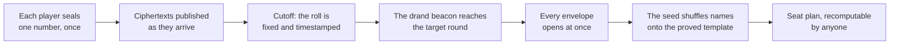

<div align="center">

# Randomised Mahjong Seating

**A seating draw for twelve players that nobody can predict, nobody can steer, and anybody can check afterwards — including the person running it.**

[](LICENSE)
[](package.json)
[](test/)
[](package.json)
[](https://drand.love)

English · [简体中文](README.zh.md)

</div>

---

Twelve players, eleven rounds, three tables of four. *Who sits with whom* is a fixed,
proved-optimal template. *Which player takes which seat in it* is decided by a draw that
all twelve contribute to, that opens itself at a pre-announced moment, and that anyone
can recompute from published data.

## Quick start

Node 24 or newer and an internet connection — the draw uses the public
[drand](https://drand.love) beacon. No accounts, no configuration.

```sh
git clone https://github.com/<you>/mahjong-random-seating.git && cd mahjong-random-seating
npm ci
npm run demo
```

`npm run demo` runs a complete draw on your machine — twelve players, a three-minute
submission window, a real timelock, a real beacon — and prints where to look:

```
  Open   http://127.0.0.1:8080

  You are player 1, 阿明: sign in with person_id 5001. The other eleven are
  simulated and will submit over the next minute or so. Submissions close at
  20:41:07; the beacon lands and the draw runs at about 20:42:07.
```

Sign in, pick a number, watch the other envelopes arrive, wait for the beacon, see the
seat plan and how to recompute it — everything a player sees, in about six minutes.

It then runs the **twelfth round**, where the tables are earned rather than drawn and only
the winds are drawn. The standings are invented, because eleven rounds were not really
played; everything after that is real, including a second beacon, the timestamped lock
published before it exists, and a draw that nobody triggers — the server does it on its
own timer when the beacon lands.

Ctrl+C when you are done; it runs in a throwaway copy and leaves nothing behind. Only
Pantheon, the club's account system, is simulated. `npm run demo -- --window 600` for a
longer look around.

## How it works



Each player picks a whole number between 0 and 255. Their browser mixes it with sixteen
random bytes it generates itself and seals the result with **timelock encryption** against
a future drand beacon round — so the ciphertext becomes readable at a moment fixed in
advance and not one second earlier. There is no key holder to bribe, subpoena or trust:
opening early is not forbidden, it is infeasible.

Every ciphertext is published, with a third party's timestamp, the moment it arrives. At
the cutoff the list of who took part is fixed, digested, and anchored into Bitcoin through
[OpenTimestamps](https://opentimestamps.org) — while the beacon that would open any of it
still does not exist. When the target round lands, all twelve envelopes open at once, the
numbers fold into one seed, and the seed permutes the twelve names onto the template.

The full argument, with figures and no mathematics assumed, is
[`docs/seating-design.md`](docs/seating-design.md). The build renders it into the
application itself, so the page a player opens from the header is that document.

## Guarantees

|  | How it is obtained |
|---|---|
| **Uniform** | Every one of the 479,001,600 assignments is equally likely. |
| **Unpredictable** | One honest contribution is enough. No majority is required, and the beacon is folded in on top. |
| **Unbiasable** | At the moment anyone submits, every other submission is still sealed. The information needed to choose a favourable number does not exist yet — for anybody, the organiser included. |
| **Unstallable** | Opening is not an action any participant performs, so refusing to open is not available. |
| **Verifiable** | The sealed ciphertexts, the beacon signature, the shuffling code and the template are all public. `node generate.js --verify results.json` recomputes every byte. |
| **Trust-free** | None of the above rests on believing that a particular person behaved honestly. |

The template is not a heuristic either: every pair of players shares a table exactly
three times, sits opposite exactly once, and the wind split at every position is exactly
{3,3,3,2}. Those figures are globally optimal and proved — the integer programmes
terminated with objective equal to bound. `python3 tools/verify_template.py
data/schedule_template.json` re-derives every one of them from the round data.

## Documentation

| Read | to | 中文 |
|---|---|---|
| [`deploy/README.md`](deploy/README.md) | **run a real draw** — one guide, in order, from a bare server to a finished event | [中文](deploy/README.zh.md) |
| [`docs/RUNBOOK.md`](docs/RUNBOOK.md) | the same sequence as a one-page checklist, for the second time | [中文](docs/RUNBOOK.zh.md) |
| [`docs/seating-design.md`](docs/seating-design.md) | understand the seating chart, and why a proved chart still needs a lottery | [中文](docs/seating-design.zh.md) |
| [`docs/PROTOCOL.md`](docs/PROTOCOL.md) | change code — what is frozen, the byte encoding, the API, quorum, the trust boundary | [中文](docs/PROTOCOL.zh.md) |
| [`docs/UI-SPEC.md`](docs/UI-SPEC.md) | the player-facing flow, stage by stage | [中文](docs/UI-SPEC.zh.md) |
| [`docs/PANTHEON-INTEGRATION.md`](docs/PANTHEON-INTEGRATION.md) | the wire format, and a local Pantheon to test against | [中文](docs/PANTHEON-INTEGRATION.zh.md) |
| [`docs/IMPLEMENTATION_NOTES.md`](docs/IMPLEMENTATION_NOTES.md) | why the code is the way it is, and what has been verified | [中文](docs/IMPLEMENTATION_NOTES.zh.md) |

## Running a real draw

Everything an organiser does is in **[`deploy/README.md`](deploy/README.md)**, in order:
the event in Pantheon, the freeze, the server, TLS, the announcement, the draw, the
close. It is written to be followed top to bottom without opening anything else.

## Development

```sh
npm test                  # 446 unit tests, offline, ~12 s
npm run rehearse          # the organiser's whole sequence, headless, in a sandbox, ~3 min
npm run e2e               # the player's journey against live drand, ~90 s
npm run verify-template   # re-derives every invariant of the seating template
```

CI ([`.github/workflows/reproducibility.yml`](.github/workflows/reproducibility.yml))
runs the tests, the template check and `node tools/build-client.js --check` — the
rebuild-and-diff of the committed bundle — on Linux and on Windows with
`core.autocrlf=true`, from an untouched clone.

A development server, against the in-process Pantheon stub:

```sh
npm run demo -- --keep                          # the quickest way: a fully set-up copy is left behind
```

Or in the tree itself, which needs an event: copy `data/protocol.example.json` to
`data/protocol.json`, run `node tools/pick-round.js --in 2h --write`, point
`PANTHEON_STUB_ROSTER` at a registrations file like the one `tools/demo.js` writes, run
`node tools/freeze.js --event <id> --write`, then:

```sh
npm run build                                   # public/app.js + app.css, from client/
PANTHEON_MODE=stub npm run serve                # http://127.0.0.1:8080 ; --port 9000 to move it
ADMIN_TOKEN=x PANTHEON_MODE=stub npm run serve  # and the organiser's dashboard at /admin?token=x
```

`PANTHEON_MODE=stub` also enables a password-free sign-in stand-in that is refused under
`NODE_ENV=production`. `data/runtime.json` (copy the example) holds operational settings —
drand mirrors, Pantheon addresses, the proxy — and is deliberately outside the freeze.

## Project status

| Area | State |
|---|---|
| The seating template and its proofs | **done and verified** — globally optimal, re-derivable by `tools/verify_template.py` |
| `generate.js` and the byte encoding | **done** — cross-checked by an independent Python implementation |
| The player application | **done** — all stages, both languages, phone included |
| The backend, the draw job and its scheduler | **done** — one process, no root, no cron |
| Pantheon integration | **done** — run against two real instances; [`docs/IMPLEMENTATION_NOTES.md`](docs/IMPLEMENTATION_NOTES.md) §6f and §10 |
| The operational sequence | **rehearsed** end to end, and deployed once for real; a first event is in progress |

## Repository layout

```
generate.js                  # PROTOCOL.md §7 — frozen; node:crypto only, no dependencies
generate-final.js            # PROTOCOL.md §11 — the twelfth round; frozen with the rest
data/
  schedule_template.json     # frozen and verified — do not hand-edit
  protocol.example.json      # FROZEN parameters: chain, target round, quorum, input range
  roster.example.json        # shape reference; the real one is written by tools/freeze.js
  runtime.example.json       # operational settings — not frozen, not tagged, optional
  substitutes.example.json   # PROTOCOL.md 11.6 — who actually sat in a seat, if it changed
                             # hands; copy only if it happens, and not frozen (it cannot be)
                             # protocol.json and roster.json are gitignored here: they are
                             # one event's data, frozen in the tree that event is run from
server/
  server.js                  # the API (PROTOCOL.md §6) and the SSE stream
  finalise.js                # the draw job and the Pantheon sync — a separate process
  schedule.js                # the timer that runs finalise.js, so no cron or systemd is needed
  rounds.js                  # voided attempts: archive, verify, and open the next one
  admin.js                   # the organiser's read-only dashboard
  pantheon.js                # the Pantheon boundary: Twirp client + in-process stub
  config.js  runtime.js      # the frozen half and the operational half of the configuration
  ciphertext.js  drand.js  ots.js  tlock.js  db.js  events.js  mirror.js  stats.js
client/
  App.jsx  stages/  waiting/  explorer/  seal.js     # the player's page; seal.js is where a number is sealed
public/
  app.js  app.css            # the built bundle — committed, part of the freeze
docs/                        # every document, with a .zh.md beside it
deploy/
  README.md                  # the deployment guide
  nginx.conf  nginx-bootstrap.conf  Caddyfile
  mahjong-relay.service  mahjong-relay.user.service
tools/
  demo.js                    # npm run demo: the whole draw on this machine
  rehearse.js                # the organiser's sequence, headless, in a sandbox
  freeze.js                  # snapshot the roster, check, commit, tag
  pick-round.js              # target_round and cutoff, kept consistent
  check-signin.js            # one account's sign-in against Pantheon, step by step
  setup-mirror.js            # the GitHub mirror token: obtain, prove it writes, store
  new-round.js  end-event.js # after a void; after the event
  lock-final.js              # 11 T1: lock the standings and the beacon, before the beacon
  draw-final.js              # 11 T2: wait for it, draw the winds, write twelve blocks
  verify_final.py            # the final round re-derived by a second, independent implementation
  verify-pantheon-final.js   # ask a LIVE Mimir the questions in PANTHEON-INTEGRATION.md 5.2
  build-client.js  md-to-page.js  verify-template.js  verify_template.py
  verify_contribution.py  decrypt-submissions.js  pantheon-fixture.js
test/                        # unit tests, and e2e.js against live drand
```

## Hard rules

1. **Do not hand-edit `data/schedule_template.json`.** Any change breaks the proved
   properties.
2. **`roster.json`, `protocol.json`, `schedule_template.json`, `generate.js` and
   `generate-final.js` are frozen and git-tagged together before submissions open, in the
   repository the event is run from.** After that a single changed byte voids the guarantee
   and the run restarts. `generate-final.js` draws a round that will not be played for
   weeks, and that is exactly why it is tagged now: its rules are fixed before anybody
   knows the standings they will be applied to.
3. **Those five, and nothing else.** A parameter is frozen if changing it mid-window could
   change or steer the outcome, and operational otherwise
   ([`docs/PROTOCOL.md`](docs/PROTOCOL.md) §4.1).
4. **The quorum rule is frozen too** ([`docs/PROTOCOL.md`](docs/PROTOCOL.md) §8). It is not
   renegotiated when a 7-of-12 situation actually arises.
5. **A voided attempt is archived, never deleted**, under `events/rounds/<target_round>/`.
6. **What a player submitted is never exposed before the reveal.** Only whether they
   submitted, and the fingerprint of the sealed envelope.
7. **Sync to Pantheon with `WIND_SHUFFLE_MODE_PRESCRIPTED`.** Any other mode re-randomises
   the winds and throws away most of what the template was optimised for.

## License

MIT — see [`LICENSE`](LICENSE). `public/app.js` is committed on purpose, because the page
that seals a player's number is part of what the freeze commits to; the libraries
compiled into it are listed with their notices in
[`THIRD-PARTY-NOTICES.md`](THIRD-PARTY-NOTICES.md), regenerated on every build.
