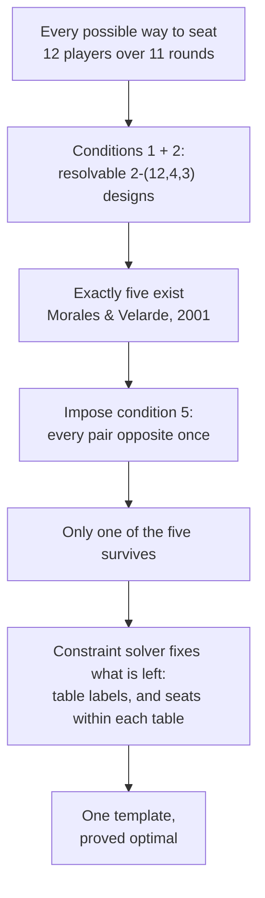
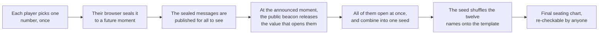
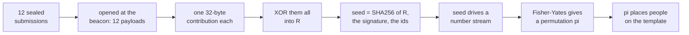

# Designing a Fair and Balanced Seating Draw for a Mahjong Tournament

> English · [简体中文](seating-design.zh.md)

Seating a mahjong tournament is a classical [block design](https://en.wikipedia.org/wiki/Block_design) problem. This league has twelve players and eleven rounds, and getting the seating right takes some care. This page uses it as the worked example for designing a fair and balanced seating draw: what we want the chart to have, which of those properties turn out to be mathematically impossible, how the remaining search is narrowed to a handful of candidates and solved to proven optimality, and why a chart that is already "optimal" still has to be handed out by a draw.

No mathematical background is assumed. The published results the argument leans on are listed at the end.

## What a fair mahjong seating chart would look like

Under the mainstream timed [riichi](https://en.wikipedia.org/wiki/Japanese_mahjong) rules, the four seats at a mahjong table are not interchangeable. Play passes counter-clockwise through East, South, West and North, and each seat sits in three different relationships to the others.


*In riichi, the only discards you may call a sequence from are your **upper hand**'s. Your **lower hand** enjoys the same privilege at your expense. Your **opposite** is across the table, with no feeding relationship between you.*

In a timed game the starting East deals more often than the starting North, and dealing is worth something: the dealer scores more on a win, draws before the others, and keeps the deal on a win. Seen from the other side, the starting East also carries more of the pressure of judging a flat game state. So a seat is not just a place to sit — it is a small, persistent advantage or disadvantage, repeated over 11 rounds.

With that in mind, here is the list of ideal properties the chart was designed against. The first is a description of the format; the other five are fairness goals.

1. **Format.** Every round splits the 12 players across three tables of four, over 11 timed rounds.
2. **Everyone plays everyone equally often.** Each pair of players shares a table exactly three times. As far as possible, no advantage or disadvantage should come from an uneven slate of opponents.
3. **Winds are shared out evenly.** Each player's 11 games are split across the four winds as evenly as arithmetic permits. 11 is not a multiple of 4, so the best possible split is 3-3-3-2, and everyone should get exactly that.
4. **Tables are shared out evenly.** Likewise for the three physical tables, so that the surroundings interfere as little as possible with judging a player's strength. 11 is not a multiple of 3 either, so the best possible split is 4-4-3, and everyone should get exactly that.
5. **Everyone faces everyone once.** Each pair of players sits opposite exactly once across the tournament.
6. **Every rivalry is balanced.** For each pair, their three meetings should consist of one opposite, one where the first player is upstream, and one where the second is. As the figure below shows, this is about removing advantage or disadvantage that comes from position.

There are 66 pairs among 12 players. Each round produces 18 pairings (six per table, three tables), and 11 rounds produce 198 of them — exactly 66 × 3. So "three meetings each" is not an arbitrary target; it is the only even split available, and 11 is exactly the number of rounds that achieves it.


*Two players meet three times. If one of those meetings is opposite and the other two run in opposite directions, the pair is **perfect** — whatever edge the upstream seat confers, each of them gets it once. If both adjacent meetings run the same way, one player spends the whole tournament upstream of the other.*

## Impossibility theorems

Lists of ideal properties in combinatorics have a habit of collapsing, and two of these six turn out to be unreachable.

Conditions 2 and 5 taken together describe an object that tournament designers have studied for over a century: a **[whist](https://en.wikipedia.org/wiki/Whist) tournament**. In whist the two players sitting opposite each other are partners, and the classical requirement is that every pair partners exactly once and opposes exactly twice — which is precisely our conditions 2 and 5. A twelve-player whist tournament, Wh(12), exists.

Add condition 6 in its ideal form — every pair balanced, all 66 of them — and the object becomes a **directed** whist tournament, DWh(12), in which every ordered pair of players occurs exactly once with one as the other's upper hand. In 2003, Haanpää and Östergård settled the classification of whist tournaments up to twelve players by exhaustive computer search, and one of their results is that **no DWh(12) exists**. **Condition 6 cannot be met in full by any schedule whatsoever.**

The second unreachable property is condition 4. Conditions 2 and 4 together — every pair meeting three times *and* every player getting a 4-4-3 split of the three tables — describe a generalized balanced tournament design, GBTD(4,3). That object has also been shown by exhaustive search not to exist.

So two of the six goals have to be relaxed, while conditions 1, 2, 3 and 5 are all satisfied exactly:

- **Condition 6** becomes: maximise the number of perfect pairs.
- **Condition 4** becomes: make each player's table split as close to 4-4-3 as possible, and minimise the total shortfall.

## Narrowing the search space

Relaxing those conditions makes the problem solvable, but the search space is still far too large to attack directly. A single round — splitting twelve people into three tables — already has 5,775 possibilities; a schedule is eleven of those stacked up, subject to all the conditions above. Brute force is hopeless.

Fortunately, two published classification results save a great deal of the work.

Conditions 1 and 2 together describe the schedule's *groupings*: who sits with whom, ignoring seats and table labels. In combinatorics that is a [resolvable](https://en.wikipedia.org/wiki/Block_design) 2-(12,4,3) design. In 2001 Morales and Velarde proved by exhaustive backtracking search that, up to relabelling the players, **exactly five such designs exist**, and they listed all five. That turns "search an astronomical space" into "check five candidate designs".

We then checked condition 5 against each of the five in turn: can this design be completed so that every pair sits opposite exactly once? For four of them a solver proved that no such completion exists. This lines up exactly with the whist classification: Haanpää and Östergård found precisely two non-isomorphic Wh(12), and noted that both are built on the same underlying design. That underlying design is the single survivor among the five resolvable 2-(12,4,3) designs.



There is a trade-off here. Three of the five designs can in fact do better on condition 4 — they allow a chart in which only *one* player misses the ideal 4-4-3 split. But all three fail condition 5 outright. The designs that balance the tables best are precisely the ones that cannot give everybody a distinct opposite. We consider balanced opposite relationships more important than balanced tables, so those three are still set aside.

## Searching for the optimum with a constraint solver

With the skeleton of the design settled, two decisions remain: which physical table each group of four goes to in each round, and how the four players are arranged into E/S/W/N once they are there. The first governs condition 4; the second governs conditions 3 and 6.

Both were handed to a [constraint solver](https://en.wikipedia.org/wiki/Constraint_programming). A solver of this kind does not merely return an answer — it returns an answer together with a proof that nothing better exists, by driving its own upper and lower bounds together until they meet. Both problems closed that way:

- **Condition 3** is met exactly: every one of the twelve seats gets a 3-3-3-2 split of the winds.
- **Condition 4** falls short by the smallest possible margin: 9 seats get the ideal 4-4-3, and 3 get 5-3-3.
- **Condition 6** reaches 55 perfect pairs out of 66.


*Left: wind balance, perfect for every seat. Right: table balance, where three seats end up at 5-3-3.*

A convenient accident makes the result cleaner than it might have been: the table-label decision and the seat-orientation decision share no variables. Changing which table a group plays at cannot affect anybody's winds or anybody's upstream/downstream relationships, and vice versa. The two optima are therefore attainable at the same time, in the same chart, so there is no priority ordering to argue about — the chart below is simultaneously the best available on condition 4 and the best available on condition 6.


*The finished template. Each row is one of the twelve seats in the schedule — not yet a person — and each column is a round. Colour gives the table; the letter gives the wind.*

## The seating draw

The template is optimal, but it is not symmetric, and that is the whole reason a draw is needed.

Three of its 12 positions carry the 5-3-3 table split rather than 4-4-3. 11 of its 66 pairs are imperfect, meaning one of the two spends the tournament upstream of the other. Even the winds, which are balanced, cannot guarantee that everybody sits North the same number of times. These blemishes cannot be removed, but they can be *handed out fairly*. Which is to say: the chart determines what is good and bad about each of the twelve positions, but a draw has to determine who sits in which.

There are 479,001,600 ways to assign twelve people to twelve template positions. Picking one of them at random is what a seating draw is, and it should have these five properties:

- **Uniform.** Every assignment is equally likely; nobody's chance of the 5-3-3 seat is different from anybody else's.
- **Unpredictable.** Nobody knows the outcome before it is produced.
- **Unbiasable.** No participant can steer it — and neither can whoever runs the draw.
- **Verifiable.** Once it is over, anybody can recompute the result and confirm it was not tampered with.
- **Trust-free.** None of the above should rest on believing that a particular person behaved honestly.

The last two are what rule out the obvious approaches. "The organiser rolls a die at home and tells everyone" fails verifiability. "The organiser runs a script" fails trust-freeness. Drawing paper slips made collectively on the spot does satisfy all five conditions, but it does not fit into the tournament's information systems, and it does not work for an online event at all.

## Sealed messages that open themselves

The natural way to build randomness that nobody owns is to have everybody contribute. Each player picks a number they like; the contributions are combined; the combination seeds the shuffle. As long as *one* contribution is genuinely unpredictable, the result is unpredictable to everyone — no honest majority required.

Nobody has to supply true randomness by hand for that to hold. Each player's number is mixed, in their own browser, with a long random value the browser generates itself. So a player who types their favourite number contributes just as unpredictably as one who rolls dice, and can still check afterwards that every step of the computation was done correctly.

The catch is timing. If the numbers are announced one at a time, whoever goes last can see what the other eleven chose and pick a number that lands the outcome where they want it. The classical fix is a [commitment scheme](https://en.wikipedia.org/wiki/Commitment_scheme): everyone seals their number first, and all the sealed messages are opened only after every one has been handed in. That works, but it costs a second round of interaction — and it leaves a hole: a participant who does not like how things are going can simply refuse to open theirs.

The scheme used here removes both problems at once, by replacing the ordinary sealed message with one that opens itself at a pre-announced moment.

It rests on a public randomness beacon called **[drand](https://drand.love/)**, jointly operated by several independent organisations, which publishes a fresh unpredictable value on a fixed schedule that nobody controls. [Timelock encryption](https://drand.love/docs/timelock-encryption/) ("tlock") lets anyone encrypt a message *to a future beacon value*: the message becomes readable once the beacon reaches that moment, and cannot be decrypted before it. There is no key holder to bribe, subpoena or trust — opening early is mathematically infeasible.



For a player this is a single action: sign in with the Pantheon account you already use for the club, type a number, submit. Everything after that happens on its own, and the finished seat plan appears both here and in Pantheon itself.

The properties asked for above follow. Nobody can steer the draw, because at the moment anyone submits, every other submission is still encrypted and unreadable — the information needed to choose a favourable number does not exist yet, for anyone, including the organiser. Nobody can hold up the opening, because opening is not an action any participant performs: once the draw time arrives, anyone at all — including people who are not participating — can compute the final result independently. And the whole thing is checkable after the fact: the sealed messages, the beacon value that opened them, the draw code and the template are all public, so any participant can repeat the computation and confirm the chart they were given is the chart the inputs produce.

One practical note. The draw goes ahead once at least eight of the twelve have submitted, since a single honest contribution is already enough to make the result unpredictable. This is mainly about tolerating what happens in practice: the availability of the whole system should not be staked on all twelve people submitting on time.

## The protocol in detail

This section sets the protocol out in detail, with the exact formulas. Everything here is deterministic: the same inputs must produce a byte-identical seating chart, or two people checking the draw would reach different answers, which would contradict the verifiability claimed above.

Write `‖` for "join these bytes together" and `SEP` for the single byte `0x1F`, the ASCII unit separator. `SHA256` is the [SHA-256](https://en.wikipedia.org/wiki/SHA-2) hash function, which turns any input into 32 bytes.



### Step 1 — the player picks a number and submits a ciphertext

When a player types a number `n`, their browser does not seal `n` on its own. It builds a payload of four fields:

| Field | What it is |
|---|---|
| `local_id` | the player's number in this event, 1 to 12 |
| `user_input` | the number they chose, 0 to 255 |
| `client_nonce` | 16 random bytes the browser generates |
| `client_timestamp` | when the browser sealed it, ISO-8601 |

The nonce is why a player who picks `7` contributes just as much randomness as one who rolls dice: the browser's own 16 random bytes are folded in as well. It is also what stops anyone guessing a submission from its ciphertext — without it, someone could seal all 256 possible numbers and compare them against it.

That payload is then timelock-encrypted to the target beacon round, and the ciphertext is published immediately. Publishing it right away is a step that **commits** the player to that submission.

### Step 2 — open the ciphertexts

At the target round the beacon value appears, every ciphertext opens, and each payload becomes one 32-byte **contribution**:

```
contribution_i = SHA256(
      DOMAIN              utf8, contains no SEP (validated)
    ‖ SEP ‖ "contrib"     ascii
    ‖ SEP ‖ local_id      1 byte,  1..255
    ‖ SEP ‖ user_input    1 byte,  0..user_input_max
    ‖ SEP ‖ nonce         exactly 16 raw bytes
    ‖ SEP ‖ timestamp     ascii ISO-8601, contains no SEP (validated)
)
```

`DOMAIN` is the frozen string `mahjong-seating-v1`. It is there so that these hashes cannot be reused as anything else.

The encoding has to be unambiguous, or two independent re-computations could disagree about the bytes and therefore about the seating. It is: every field is either fixed width (`local_id`, `user_input`, `nonce`) or is validated to contain no `SEP` (`DOMAIN`, `timestamp`). So no two distinct inputs can produce the same byte string. The separators are belt and braces on top of that; the validation is what actually earns the guarantee, which is why a field that could smuggle a `SEP` is rejected rather than escaped.

### Step 3 — XOR the contributions into R

The contributions are sorted by `local_id` and combined with [XOR](https://en.wikipedia.org/wiki/Exclusive_or), byte by byte, with nothing truncated:

```
R = contribution_1 XOR contribution_2 XOR … XOR contribution_n      (32 bytes)
```

XOR has exactly the property this step needs: if even one of the values is uniformly random and independent of the rest, the result is uniformly random, no matter what the others are. That is the "one honest contribution is enough" property, made concrete.

The order matters, and it is hash first, XOR second. XOR does not mix across bit positions, so XORing raw payloads would let someone who submits last cancel out chosen bits of the others. Hashing first destroys that: to steer a bit of `R` you would have to choose a payload whose SHA-256 has a chosen bit, and you cannot see the other hashes yet anyway.

### Step 4 — derive the seed

`R` alone is not yet the random seed. The beacon signature and the list of who took part are added to it:

```
seed = SHA256(
      DOMAIN ‖ SEP ‖ "seed"
    ‖ SEP ‖ R             32 raw bytes
    ‖ SEP ‖ signature     raw bytes, hex-decoded (not the hex text — no case ambiguity)
    ‖ SEP ‖ local_ids     1 byte each, ascending
)
```

The `signature` is drand's [BLS signature](https://en.wikipedia.org/wiki/BLS_digital_signature) for the target round — the same value that opened the ciphertexts. Adding it in means the draw does not rest on the twelve browsers alone: even if every player colluded, they would still not know the beacon value when they submitted. Including `local_ids` is there to tell one draw from another: a draw among a different set of participants is a different draw, even with identical numbers.

### Step 5 — turn the seed into random numbers

The random seed is 32 bytes; a shuffle needs a stream. The stream is SHA-256 in counter mode:

```
block(i) = SHA256(seed ‖ uint32be(i)),  for i = 0, 1, 2, …
```

concatenated, and read four bytes at a time as a big-endian unsigned 32-bit integer.

To get a uniform integer in `0..bound-1`, the code uses [rejection sampling](https://en.wikipedia.org/wiki/Rejection_sampling), not the modulo operator:

```
limit = floor(2^32 / bound) * bound
draw v from the stream; if v >= limit, throw it away and draw again
return v mod bound
```

Plain `v mod bound` would be very slightly biased toward small values, because 2³² is not a multiple of `bound`. The bias is tiny, but "uniform" is one of the five properties promised above, and rejection sampling makes it exact rather than nearly true.

### Step 6 — shuffle

A descending ("modern") [Fisher-Yates shuffle](https://en.wikipedia.org/wiki/Fisher%E2%80%93Yates_shuffle) over the participating `local_id`s in ascending order:

```
a = [the roster's local_ids, ascending]
for i = len(a)-1 down to 1:
    j = uniform integer in 0..i        (from step 5)
    swap a[i] and a[j]
pi = a
```

Fisher-Yates with an exactly uniform source produces each of the 12! = 479,001,600 orderings with equal probability. The result is read as:

```
pi[k] = the local_id seated on abstract point k of the template   (k = 0..11)
```

### Step 7 — apply the template

The template is fixed and public. It says, for every round, which abstract point 0–11 sits at which table in which wind. Step 6 said which person is on which point. Composing the two gives the seating chart:

```
seat(round, table, wind) = pi[ template[round][table][wind] ]
```

And that is the whole draw.

### A worked example

Real numbers, reproducible by hand. Twelve players submit, and for the sake of the example the nonces are the player's `local_id` byte repeated sixteen times and the timestamps are one second apart:

| `local_id` | `user_input` | `client_nonce` | `client_timestamp` |
|---|---|---|---|
| 1 | 7 | `0101…01` (16 bytes) | `2026-09-12T20:00:00Z` |
| 2 | 42 | `0202…02` | `2026-09-12T20:00:01Z` |
| 3 | 13 | `0303…03` | `2026-09-12T20:00:02Z` |
| … | … | … | … |
| 12 | 77 | `0c0c…0c` | `2026-09-12T20:00:11Z` |

The remaining numbers are 88, 3, 100, 21, 55, 9, 64, 30 for players 4 to 11. Step 2 gives each player a contribution; the first three are:

```
c_1 = 0bba2e78edeefb29e637d0e458d6afdd016617829a2faf11d7bddf96de0c936f
c_2 = c90010f679459b65fb010a8acb54a9b2ab18221587d35559e9623da766acbf38
c_3 = cadc54ed7465200610b2be310b8efc49995c0a5387575ebe8842ef9d1bf7cf76
```

Step 3 XORs all twelve. Watching just the first byte as each contribution goes in:

```
0b → c2 → 08 → 98 → e2 → 59 → 6b → 7d → 36 → 61 → 14 → 17

R = 17b4ab1349f8060ff31c2c739f7ff4c37d510329c3a9d78a3c89de9c76338052
```

Step 4 folds in the beacon. Taking drand quicknet round 1,000,000, whose signature is public:

```
signature = 83ad29e4c409f9470fc2ef02f90214df49e02b441a1a241a82d622d9f608ef98
            fd8b11a029f1bee9d9e83b45088abe72

seed      = 75c55c877d1b5e279a2b5629de7b041dedc5dadda05e64b3c62fbb2954d1cd30
```

Steps 5 and 6 turn that seed into the permutation:

```
pi = [2, 4, 8, 7, 10, 6, 12, 5, 1, 11, 3, 9]
```

Read it as: template point 0 is player 2, point 1 is player 4, point 2 is player 8, and so on. Step 7 then reads the template — round 1, table 1 is points 0, 1, 2, 3 in E/S/W/N order — so in round 1 player 2 sits East at table 1, player 4 South, player 8 West, player 7 North.

Change any single input and everything after it changes completely: one player typing 8 instead of 7 gives a different `c_1`, a different `R`, a different seed, and an unrelated permutation. That is what makes the draw unsteerable, and it is also why the published inputs are enough for anyone to check the output.

### Checking it yourself

Everything above is in the repository, and deliberately in two independent implementations so that agreement means something:

- `generate.js` computes the chart, and `node generate.js --verify results.json` recomputes it from the file's own revealed payloads and diffs it byte for byte.
- `tools/verify_contribution.py` re-derives `R` and the seed in Python, written from this specification rather than from the JavaScript. If the encoding above were ambiguous, the two would disagree.
- `generate-final.js` draws the twelfth round, and `node generate-final.js --verify final.json` reproduces it byte for byte from the published standings lock and the second beacon.
- `tools/verify_final.py` is that draw's second implementation, again written from the specification. It rebuilds the counter-mode stream and its rejection sampling from scratch, because that is the one place two honest implementations quietly diverge: a version using `value % bound` reproduces most draws and not all of them.

## The twelfth round

After the eleven round-robin rounds, a final round is played. Its **tables are earned**: the top four of the standings sit at table one, the next four at table two, the last four at table three. Only its **winds are drawn**.

That makes it a different problem from the first draw, and it needs its own argument. The first draw had 479,001,600 outcomes and the fairest thing to do with them was to pick one uniformly. Here there are 24 outcomes per table, the tables are already decided, and picking uniformly turns out to be the *worst* of the available options rather than the most even-handed. The rest of this section is why.

### Why the winds are the only thing left to be fair about

A seat plan can affect a player's result through exactly two channels: which winds they get, and which opponents they face. The second one is settled. Over the eleven rounds the template pushes it to the proved optimum — every pair meets three times, every pair sits opposite once, 55 of the 66 pairs are perfectly balanced — and in the twelfth round it is decided by the standings, not by any draw. So the only thing the final draw can still move is the winds.

And for the winds there is an exact target, which comes from mahjong itself rather than from a model of it.

At a table, the four players finish first, second, third and fourth. Raw points are zero-sum, and the uma is zero-sum too — whatever the placement bonuses are, they add to nothing. So if four players of equal strength differ only in where they sit, the four seats' expected contributions must add to exactly zero:

```
v(E) + v(S) + v(W) + v(N) = 0
```

`v(w)` is what starting in seat `w` is worth over one game. **This is an identity, not an estimate.** It holds without anyone knowing what `v(E)` actually is.

Now take a player's accumulated seat handicap over the whole tournament, `H = Σ n_w · v(w)`, where `n_w` is how many times they started in wind `w`:

- **3-3-3-3** gives `H = 3·(v(E) + v(S) + v(W) + v(N)) = 3 × 0 = 0`. Exactly zero, whatever the values of `v` are. Such a player carries no systematic seat advantage or disadvantage into the final standings at all.
- **4-3-3-2** — one extra `a`, one missing `b` — gives `H = v(a) − v(b)`. Small, but non-zero, and *systematic*: it does not average out with more games, because it is not noise. It is a constant tilt.

After eleven rounds **every** player is on 3-3-3-2 (condition 3, which the template satisfies exactly). So every one of the twelve is carrying `H₁₁ = −v(x)`, where `x` is the wind they are short of. The twelfth round is the only remaining chance to cancel it.

This is why "everybody gets three of each wind" is not an aesthetic preference. It is the point at which a player's seat handicap is provably zero.

### What the draw is choosing between

The eleven-round template gives each of its twelve positions a 3-3-3-2 wind split, so each position is short of exactly one wind. Computed from the template itself, those twelve deficits are:

| Position | 0 | 1 | 2 | 3 | 4 | 5 | 6 | 7 | 8 | 9 | 10 | 11 |
|---|---|---|---|---|---|---|---|---|---|---|---|---|
| Short of | N | W | N | W | W | S | N | E | E | S | S | E |

Three positions short of each wind — which is the best the template could have done, and is checked rather than assumed every time the final round is drawn.

At one table of four, a seating is a bijection from the four players (in rank order) to the four winds, so there are 24 of them. Write each as the seat index given to the 1st, 2nd, 3rd and 4th-placed player of that table, with seats indexed `0=E, 1=S, 2=W, 3=N`, and enumerate them in lexicographic order:

```
 0: 0123   1: 0132   2: 0213   3: 0231   4: 0312   5: 0321
 6: 1023   7: 1032   8: 1203   9: 1230  10: 1302  11: 1320
12: 2013  13: 2031  14: 2103  15: 2130  16: 2301  17: 2310
18: 3012  19: 3021  20: 3102  21: 3120  22: 3201  23: 3210
```

That order is part of the result, not a presentation detail: the published draw records an *index* into the optimal ones, so a second implementation that enumerated differently would agree on the seed and disagree on the seats — the worst kind of disagreement, because nothing fails.

Two facts about one table, both checkable by hand over all 256 possible tables:

- The most players that can be completed is the number of **distinct** winds the four are short of. Give one representative of each distinct wind the wind they need; whoever is left takes a seat nobody wanted.
- If `m` players at a table are short of the **same** wind, only one of them can have it. Under a draw that is uniform among the best seatings, each of those `m` has probability `1/m` of finishing on 3-3-3-3, and the others do not.

That `1/m` is the cost of this design, and it is shown to each player on the result page rather than left to be inferred.

### Maximising completion and equalising the odds are incompatible

The obvious alternative is to draw all 24 seatings uniformly. It is perfectly even-handed, and it achieves nothing:

```
E[players completed] = Σ over players of P(that player gets the wind they are short of)
```

If every player's wind is uniform, every term is 1/4 and the sum is exactly 12 × 1/4 = **3**. So *any* design that completes more than three players on average must give some players a better than 1-in-4 chance at some wind — which means the probabilities depend on the standings, which is exactly the lever that a uniform draw does not have. **The two properties cannot both be had.** This is not an artefact of the implementation; it follows from the identity above.

Four designs on that frontier, all computed exhaustively over the 34,650 ways the twelve deficits can fall into three tables of four:

| Design | E[completed] | P(East), across players | Residual seat bias |
|---|---|---|---|
| **A — best seatings, then uniform among them** | **8.95** | 0.085–0.745 | **0.339** |
| C — draw East first, then optimise the rest | 6.31 | flat 0.250 | depends on `v` |
| D — draw East and North first, then optimise | 4.23 | flat 0.250 | depends on `v` |
| B — uniform over all 24 | 3.00 | flat 0.250 | **1.000** |

C and D buy the lever back by spending completions on it: fixing East uniformly means nobody's chance of dealing first can depend on the standings, and D does the same for North. Their residual bias has no single value, because the four deficiency classes fare differently under them and the comparison then turns on what `v` actually is. A and B are the two ends where it does not.

**Design A is the one in use.** The last column is what the argument above turns the first column into. Under A, a player short of wind `x` gets `x` with probability `P = 0.7455` and each of the other three winds with probability `0.0848` — exactly symmetric across all four deficiency classes, which is asserted in the tests rather than assumed. From that:

```
E[H₁₂] / H₁₁ = (4/3)·(1 − P)
```

which is `0.339` for design A and exactly `1.000` for a uniform draw. Read plainly: **design A leaves each player with 34% of the systematic seat bias the round-robin gave them; drawing uniformly leaves 100% of it, untouched.** `E[completed] = 8.95` is not a beauty contest score. It is literally the number of players who walk into the final standings carrying a provably zero seat handicap.

And the uma makes this argument stronger, not weaker. Placement bonuses convert a small points edge into a placement-probability edge, and a placement is a large fixed jump. Measured in the currency that decides the final standings, `v(E) − v(N)` is *bigger* with uma than without. The bias design A corrects matters more under uma, not less.

The full distribution, over all 34,650 cases:

| Players completed | 6 | 7 | 8 | 9 | 10 | 11 | 12 |
|---|---|---|---|---|---|---|---|
| Cases | 792 | 1,944 | 11,178 | 7,776 | 11,664 | 0 | 1,296 |
| Share | 2.29% | 5.61% | 32.26% | 22.44% | 33.66% | **0%** | 3.74% |

The mean is exactly 309,960 / 34,650 = 4428/495 ≈ 8.9455.

**Exactly eleven is impossible**, and the reason is short enough to check here. A table completes everyone precisely when its four deficits are all different, so exactly one player left short would mean one table with three distinct deficits and two with four. But two tables of four distinct winds use up one of each wind twice over, and the twelve deficits are three of each — so the four left for the third table are exactly one of each, which is four distinct winds, not three. The case cannot arise.

So the first question anyone asks — *is there always an arrangement that puts everyone on 3-3-3-3, whatever the standings?* — has the answer **no**. The best any design can do is what the table above shows, and 3.74% of the time the standings happen to allow all twelve anyway.

### What this costs, stated rather than buried

Three consequences follow, and none of them is hidden:

**There is a lever, and it is small and measurable.** Because the eleven-round permutation is public from the first draw, every player knows from day one who else is short of the same wind. A player short of East does better if the other two East-deficient players end up in *different* rank bands (`P` rises from 0.745 to 1.000); a player short of North does better beside them (`P` falls to 0.333). Only the band matters — 1-4, 5-8, 9-12 — never the rank within it. A perfect manipulation moves `E[H₁₂]` from `−0.34·v(x)` to `0`, so **the entire prize is 0.34 × what one seat is worth in one game**, and the price is moving a rank band: three different opponents in a zero-sum final, and a different finishing position. It is a bad trade — but now it is a bad trade with a number attached, rather than an assurance that it probably is not worth it.

**Sometimes the beacon decides nothing.** When all three tables happen to hold four distinct deficits, each table has exactly one optimal seating and the entire final round is settled before the signature exists. That is the 3.74% column above. The draw still runs, still publishes, and still verifies — it simply had no choice to make.

**The 8.95 and the 3.74% assume the standings are independent of the template positions.** The permutation is drawn uniformly, but a template position affects the schedule, which affects results. So these are figures under a stated model, not theorems. The `1/m`, the zero-sum identity and the impossibility of exactly eleven are not modelled; they hold outright.

Two limits on the zero-sum argument itself, for completeness:

1. `v` is independent of the table only when the four players are of comparable strength. A final-round table is by construction *not* four random players — table one is the top four. So the correction is right in direction but not exactly value-neutral. Doing better would require modelling how strong each player is, which is the last thing that should ever enter a seating draw.
2. `H = 0` is an expectation. Over twelve games the variance is far larger than `v`. The claim is about systematic tilt, not about who wins.

One last thing worth saying plainly, because it is easy to misread: the final round's tables come from the standings after **eleven** rounds. If all twelve games carry equal weight, the standings after twelve may differ — the four players at table one are not necessarily the final top four. That is normal for this format, and it is the intended behaviour, not a defect.

## Appendix: the template

Rows are rounds; entries are template positions 0–11, which the draw assigns to people. Within each table the four columns are the East, South, West and North seats.

| Round | T1 E | T1 S | T1 W | T1 N | T2 E | T2 S | T2 W | T2 N | T3 E | T3 S | T3 W | T3 N |
|---|---|---|---|---|---|---|---|---|---|---|---|---|
| 1 | 0 | 1 | 2 | 3 | 9 | 8 | 10 | 11 | 5 | 6 | 7 | 4 |
| 2 | 5 | 10 | 4 | 11 | 0 | 2 | 8 | 1 | 3 | 7 | 6 | 9 |
| 3 | 6 | 4 | 0 | 3 | 8 | 5 | 7 | 1 | 10 | 9 | 2 | 11 |
| 4 | 7 | 11 | 4 | 2 | 3 | 8 | 9 | 6 | 1 | 5 | 0 | 10 |
| 5 | 1 | 9 | 7 | 5 | 6 | 11 | 2 | 0 | 4 | 3 | 10 | 8 |
| 6 | 11 | 8 | 3 | 5 | 7 | 0 | 6 | 10 | 9 | 2 | 1 | 4 |
| 7 | 10 | 6 | 1 | 9 | 4 | 7 | 8 | 2 | 5 | 3 | 11 | 0 |
| 8 | 8 | 0 | 9 | 4 | 1 | 7 | 11 | 3 | 2 | 6 | 5 | 10 |
| 9 | 6 | 2 | 5 | 8 | 3 | 4 | 10 | 1 | 9 | 11 | 0 | 7 |
| 10 | 2 | 10 | 3 | 7 | 0 | 4 | 5 | 9 | 11 | 1 | 6 | 8 |
| 11 | 4 | 1 | 11 | 6 | 2 | 3 | 9 | 5 | 10 | 0 | 8 | 7 |

## References

- L. B. Morales and C. Velarde, [*A complete classification of (12,4,3)-RBIBDs*](https://doi.org/10.1002/jcd.1019), Journal of Combinatorial Designs **9** (2001), 385–400. Establishes that exactly five such designs exist and lists them.
- H. Haanpää and P. R. J. Östergård, [*Classification of whist tournaments with up to 12 players*](https://doi.org/10.1016/S0166-218X%2802%2900578-4), Discrete Applied Mathematics **129** (2003), 399–407. Establishes that exactly two Wh(12) exist, that both share one underlying design, and that no DWh(12) exists.
- Y. M. Chee, H. M. Kiah and C. Wang, [*Generalized Balanced Tournament Designs with Block Size Four*](https://doi.org/10.37236/2717), Electronic Journal of Combinatorics **20**(2) (2013), #P51. Establishes by exhaustive search that no GBTD(4,3) exists.
