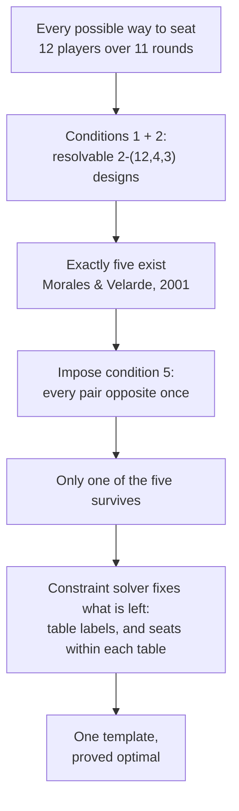
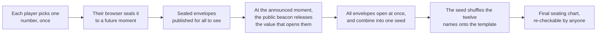

# How the Seating Chart Was Built

Twelve players, eleven rounds, three tables of four. This page explains where the seating chart came from: what we wanted from it, which parts of that wish list turned out to be mathematically impossible, how the remaining search was narrowed down to a handful of candidates and then solved to proven optimality, and why a chart that is provably the best possible still has to be handed out by lottery.

No mathematical background is assumed. The published results the argument leans on are listed at the end.

## What a fair seating chart would look like

At a mahjong table the four seats are not interchangeable. Play passes counter-clockwise through East, South, West and North, and each seat sits in three different relationships to the others.

*The three relationships that matter. Your **upper hand** discards immediately before your turn — in riichi, the only player you may call a sequence from. Your **lower hand** gets that same privilege at your expense. Your **opposite** is across the table, neither feeding you nor fed by you.*

East also deals, and dealing is worth money: the dealer scores more, pays more, and keeps the deal on a win. So a seat is not just a place to sit — it is a small, persistent advantage or disadvantage, repeated over eleven rounds.

With that in mind, here is the wish list the chart was designed against. The first is a description of the format; the other five are fairness goals.

1. **Format.** Every round splits the twelve players across three tables of four, with the seats running counter-clockwise E → S → W → N.
2. **Everyone plays everyone equally often.** Each pair of players shares a table exactly three times. Nobody draws a harder or easier slate of opponents than anybody else.
3. **Winds are shared out evenly.** Each player's eleven games are split across the four winds as evenly as arithmetic permits. Eleven does not divide by four, so the best possible split is 3-3-3-2, and everyone should get exactly that.
4. **Tables are shared out evenly.** Likewise for the three physical tables — one may be by the window, one may be the automatic table, one may be next to the door. Eleven over three gives 4-4-3, and everyone should get exactly that.
5. **Everyone faces everyone once.** Each pair of players sits opposite exactly once across the tournament.
6. **Every rivalry is balanced.** For each pair, their three meetings should consist of one opposite, one where the first player is upstream, and one where the second is. Then neither player spends the tournament systematically feeding the other.

The arithmetic behind this wish list is unusually tidy, which is what makes the whole exercise worth doing. There are 66 pairs of players. Each round produces 18 pairings (six per table, three tables), and eleven rounds produce 198 of them — exactly 66 × 3. So "three meetings each" is not a target we picked; it is the only even split available, and eleven is exactly the right number of rounds for it. The same coincidence appears again with condition 5: each round seats six opposite pairs, and eleven rounds produce 66 — precisely one per pair, with nothing to spare.

Condition 6 is the one worth dwelling on, because it is the least obvious and the most valuable.

*Two players meet three times. If one of those meetings is opposite and the other two run in opposite directions, the pair is **perfect** — whatever small edge sitting upstream confers, each of them gets it once. If both adjacent meetings run the same way, one player spends the whole tournament upstream of the other.*

## Two theorems that say no

Wish lists in combinatorics have a habit of collapsing, and two of these six goals turn out to be unreachable — not "hard to find", but provably non-existent.

Conditions 2 and 5 taken together describe an object that tournament designers have studied for over a century: a **whist tournament**. In whist, the two players sitting opposite each other are partners, and the classical requirement is that every pair partners exactly once and opposes exactly twice — which is precisely our conditions 2 and 5. A twelve-player whist tournament, Wh(12), exists.

Add condition 6 in its ideal form — every pair balanced, all 66 of them — and the object becomes a **directed** whist tournament, DWh(12), in which every ordered pair of players occurs exactly once with one as the other's left-hand opponent. In 2003, Haanpää and Östergård settled the classification of whist tournaments up to twelve players by exhaustive computer search, and one of their results is that **no DWh(12) exists**. Condition 6 cannot be met in full by any schedule whatsoever.

The second collapse is condition 4. Conditions 2 and 4 together — every pair meeting three times *and* every player getting a 4-4-3 split of the three tables — describe a generalized balanced tournament design, GBTD(4,3). That object has also been shown by exhaustive search not to exist.

So two of the six goals had to be weakened, and the weakenings were dictated by theorems rather than by convenience:

- **Condition 6** becomes: maximise the number of perfect pairs.
- **Condition 4** becomes: make each player's table split as close to 4-4-3 as possible, and minimise the total shortfall.

Conditions 1, 2, 3 and 5 stayed exact. Nothing about them had to give.

## Five candidates, then one

Even after weakening, the search is far too large to attack directly. A single round is a way of splitting twelve people into three tables, and there are 5,775 such splits; a schedule is eleven of them stacked up, subject to all the conditions above. Brute force is hopeless.

Two published classification results collapse that space almost entirely.

Conditions 1 and 2 together say that the schedule's *groupings* — who sits with whom, ignoring seats and table labels — form what is called a resolvable 2-(12,4,3) design. In 2001 Morales and Velarde proved by exhaustive backtracking search that, up to relabelling the players, **exactly five such designs exist**, and they printed all five. That reduces "search an astronomical space" to "check five candidates".

We then imposed condition 5 on each of the five in turn: can this design be completed so that every pair sits opposite exactly once? For four of them the answer is a flat no — not "we could not find a way", but a solver proving no way exists. Only one of the five survives. This lines up exactly with the whist classification: Haanpää and Östergård found precisely two non-isomorphic Wh(12), and noted that both are built on the same underlying design. The skeleton of our chart is therefore not a choice at all — it is forced.

There is a sting in this. Three of the five designs can in fact do better on condition 4 — they allow a chart in which only *one* player misses the ideal 4-4-3 split. But all three are among the four that cannot satisfy condition 5 at all. The designs that balance the tables best are precisely the ones that cannot give everybody a distinct opposite, so that better table balance is out of reach.

## What the solver settled

With the design forced, two decisions remained: which physical table each group of four goes to in each round, and how the four players are arranged into E/S/W/N once they are there. The first governs condition 4; the second governs conditions 3 and 6.

Both were handed to a constraint solver. What matters here is that a solver of this kind does not merely return a good answer — it returns an answer together with a proof that nothing better exists, by driving its own upper and lower bounds together until they meet. Both problems closed that way:

- **Condition 3** is met exactly: every one of the twelve seats gets a 3-3-3-2 split of the winds.
- **Condition 4** falls short by the smallest possible margin: nine seats get the ideal 4-4-3, and three get 5-3-3.
- **Condition 6** reaches 55 perfect pairs out of 66 — the maximum, given everything else.

*Left: wind balance, perfect for every seat. Right: table balance, where three seats end up at 5-3-3. That gap is the visible residue of the impossibility theorem — no schedule anywhere avoids it.*

A convenient accident makes the result cleaner than it might have been: the table-label decision and the seat-orientation decision share no variables. Changing which table a group plays at cannot affect anybody's winds or anybody's upstream/downstream relationships, and vice versa. The two optima are therefore attainable at the same time, in the same chart, and there is no priority ordering to argue about — the chart below is simultaneously the best available on condition 4 and the best available on condition 6.

*The finished template. Each row is one of the twelve seats in the schedule — not yet a person — and each column is a round. Colour gives the table; the letter gives the wind.*

## Why the chart still needs a lottery

The template is optimal, but it is not symmetric, and that is the whole reason a lottery is needed.

Three of its twelve positions carry the 5-3-3 table split rather than 4-4-3. Eleven of its 66 pairs are imperfect, meaning one of the two spends the tournament upstream of the other. These blemishes cannot be removed — the theorems above rule that out — but they can be *distributed without favour*. Which is to say: the chart determines what the twelve positions are like, and something else has to determine who sits in them.

There are 479,001,600 ways to assign twelve named people to twelve template positions. Picking one of them is the only remaining decision, and it should have five properties:

- **Uniform.** Every assignment is equally likely; nobody's chance of the 5-3-3 seat is different from anybody else's.
- **Unpredictable.** Nobody knows the outcome before it happens.
- **Unbiasable.** No participant can steer it — and neither can whoever runs the draw.
- **Verifiable.** Once it is over, anybody can recompute the result and confirm it was not tampered with.
- **Trust-free.** None of the above should rest on believing that a particular person behaved honestly.

The last two are what rule out the obvious approaches. "The organiser rolls a die at home and tells everyone" fails verifiability. "The organiser runs a script" fails trust-freeness — not because the organiser is suspect, but because a scheme that depends on their good behaviour proves nothing to anyone who was not watching.

## Envelopes that open themselves

The natural way to build randomness that nobody owns is to have everybody contribute. Each player picks a small number — anything from 0 to 255, a birthday or a lucky number is fine; the contributions are combined; the combination seeds the shuffle. As long as *one* contribution is genuinely unpredictable, the result is unpredictable to everyone — no majority required.

Nobody has to supply real randomness by hand for that to hold. Each player's number is mixed, in their own browser, with a long random value the browser generates itself, and the mixture is what actually goes into the envelope. So a player who types their favourite number contributes just as unpredictably as one who rolls dice, and can still check afterwards that their own number is in there. The beacon value described below is folded in at the end as well, so the draw does not rest on the twelve browsers alone.

The catch is timing. If the numbers are announced one at a time, whoever goes last can see the other eleven and pick their own number to land on the outcome they want. The classical fix is to have everyone seal their number in an envelope first, and open all the envelopes only after every one has been handed in. That works, but it costs a second round of interaction — and it leaves the door open to a participant who, having seen how things are going, simply refuses to open their envelope.

The scheme used here removes both problems by replacing the envelope with one that opens itself at a pre-announced moment.

This rests on a public randomness beacon called **drand**, jointly operated by several independent organisations, which publishes a fresh unpredictable value on a fixed schedule that nobody controls. Timelock encryption ("tlock") lets anyone seal a message *to a future beacon value*: the message becomes readable once the beacon reaches that moment, and cannot be read before it. There is no key holder to bribe, subpoena or trust — early opening is not forbidden, it is infeasible.

For a player this is a single action: sign in with the Pantheon account you already use for the club, type a number, submit, close the page. There is nothing to come back for, nothing to keep open, and no second round to understand. Everything after that happens on its own, and the finished seat plan appears both here and in Pantheon itself.

The properties asked for above follow. Nobody can steer the draw, because at the moment anyone submits, every other submission is still sealed — the information needed to choose a favourable number does not exist yet, for anyone, including the organiser. Nobody can stall it, because opening is not an action any participant performs. And the whole thing is checkable after the fact: the sealed envelopes, the beacon value that opened them, the shuffling code and the template are all public, so any participant can repeat the computation and confirm the chart they were given is the chart the inputs produce.

Two practical notes. The draw goes ahead once at least eight of the twelve have submitted, since a single honest contribution is already enough to make the result unpredictable, and waiting on a straggler would only give one person the power to hold up the whole tournament. And a player who never submits has abstained from an outcome nobody could see yet — an absence, not a manoeuvre.

## Appendix: the template

Rows are rounds; entries are template positions 0–11, which the draw assigns to people. Within each table the four columns are the East, South, West and North seats.

| Round | T1 E | T1 S | T1 W | T1 N | T2 E | T2 S | T2 W | T2 N | T3 E | T3 S | T3 W | T3 N |
|---|---|---|---|---|---|---|---|---|---|---|---|---|
| 1 | 0 | 1 | 2 | 3 | 9 | 8 | 10 | 11 | 5 | 6 | 7 | 4 |
| 2 | 5 | 10 | 4 | 11 | 0 | 2 | 8 | 1 | 3 | 7 | 6 | 9 |
| 3 | 6 | 4 | 0 | 3 | 8 | 5 | 7 | 1 | 10 | 9 | 2 | 11 |
| 4 | 7 | 11 | 4 | 2 | 3 | 8 | 9 | 6 | 1 | 5 | 0 | 10 |
| 5 | 1 | 9 | 7 | 5 | 6 | 11 | 2 | 0 | 4 | 3 | 10 | 8 |
| 6 | 11 | 8 | 3 | 5 | 7 | 0 | 6 | 10 | 9 | 2 | 1 | 4 |
| 7 | 10 | 6 | 1 | 9 | 4 | 7 | 8 | 2 | 5 | 3 | 11 | 0 |
| 8 | 8 | 0 | 9 | 4 | 1 | 7 | 11 | 3 | 2 | 6 | 5 | 10 |
| 9 | 6 | 2 | 5 | 8 | 3 | 4 | 10 | 1 | 9 | 11 | 0 | 7 |
| 10 | 2 | 10 | 3 | 7 | 0 | 4 | 5 | 9 | 11 | 1 | 6 | 8 |
| 11 | 4 | 1 | 11 | 6 | 2 | 3 | 9 | 5 | 10 | 0 | 8 | 7 |

## References

- L. B. Morales and C. Velarde, *A complete classification of (12,4,3)-RBIBDs*, Journal of Combinatorial Designs **9** (2001), 385–400. Establishes that exactly five such designs exist and lists them.
- H. Haanpää and P. R. J. Östergård, *Classification of whist tournaments with up to 12 players*, Discrete Applied Mathematics **129** (2003), 399–407. Establishes that exactly two Wh(12) exist, that both share one underlying design, and that no DWh(12) exists.
- *Generalized Balanced Tournament Designs with Block Size Four*, Electronic Journal of Combinatorics **20**(2) (2013), #P51. Establishes by exhaustive search that no GBTD(4,3) exists.
