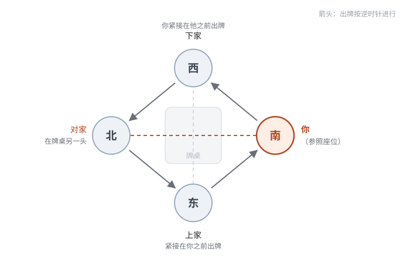
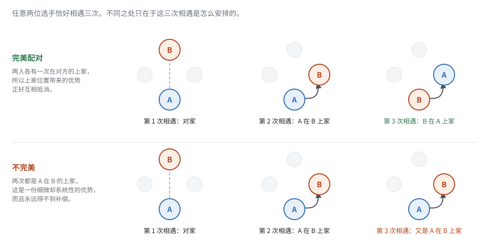
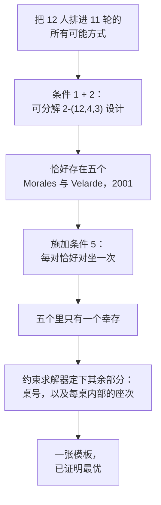
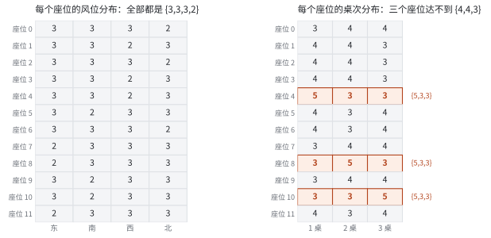
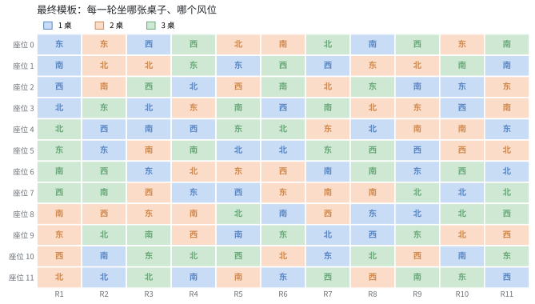
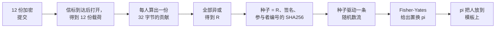

# 公平且平衡的麻将锦标赛座位抽签机制设计

> [English](seating-design.md) · 简体中文

麻将锦标赛的座位抽签属于数学上经典的 [Block Design](https://en.wikipedia.org/wiki/Block_design)（区组设计）问题。本次联赛一共有十二位选手，进行十一轮比赛，需要进行仔细的设计。本文主要以本次联赛为例讲解如何设计一次公平且平衡的麻将锦标赛座位抽签机制：我们希望它具备什么性质，其中哪几条性质被证明在数学上不可能做到，剩下的搜索空间如何被压缩到屈指可数的几个候选并求解到可证最优，以及一张已经「最优」的表为什么仍然必须再次靠抽签来分发座位。

不需要数学背景。文末列出了论证所依据的已发表结果。

## 一张公平的麻将比赛座位表应该是什么样的

在现行的主流计时[立直麻将](https://zh.wikipedia.org/wiki/%E6%97%A5%E6%9C%AC%E9%BA%BB%E5%B0%86)规则下，麻将桌上的四个座位并不等价。出牌按逆时针经过东、南、西、北，每个座位与其余三家处在三种不同的关系中。



*立直麻将里，只有你的**上家**的牌你可以吃。你的**下家**反过来享有同样的便利。你的**对家**在桌子另一头，与你之间不存在喂牌的关系。*

起始东家在计时赛中坐庄的机会比起始北家要多，而坐庄是有价值的：庄家和牌得分更多、比其他家优先摸牌，且和牌连庄。从另一个角度来讲，起始东家也比其他家面临更多的平场场况判断压力。所以座位不只是一个位置，它是一份小而持续的优势或劣势，在 11 轮里反复出现。

有了这个认识，下面是这张表当初被设计时对照的理想性质清单。第一条是赛制的描述，其余五条是公平性目标。

1. **赛制。** 每一轮把 12 人分到三张四人桌，共进行 11 轮计时比赛。
2. **每个人和每个人对局的次数相同。** 任意两人恰好同桌三次。尽量排除因为不均匀的对手表而造成的优势或者劣势。
3. **风位平均分配。** 每人的 11 局在四个风位之间尽可能均匀地分开。11 不是 4 的倍数，所以能做到的最好是 3-3-3-2，而且每个人都应该正好是这个分布。
4. **桌子平均分配。** 三张实体麻将桌同理，尽可能排除环境对选手实力评估的干扰。11 也不是 3 的倍数，所以能做到的最好是 4-4-3，每个人都应该正好是这个分布。
5. **每个人和每个人对坐一次。** 任意两人在整届赛事中恰好对坐一次。
6. **每一对关系都是平衡的。** 对任意一对选手，他们的三次相遇应当由一次对坐、一次前者在上家、一次后者在上家构成。如下图所示，尽量排除因位置而造成的优势或者劣势。

12 人共有 66 对。每一轮产生 18 个配对（每桌六个，三桌），11 轮产生 198 个——正好是 66 × 3。所以「每对三次」不是随意挑出来的目标，它是唯一可行的均分方式，而 11 恰好是达成它所需的轮数。



*两位选手相遇三次。如果其中一次是对家，另外两次方向相反，这一对就是**完美**的——上家位置带来的优势，两人各得一次。如果两次相邻相遇方向相同，那么其中一人整届比赛都在另一人的上家。*

## 不可能性定理

组合学里的理想性质清单常有崩塌的习惯，这六条里有两条被证明无法实现。

第 2 条和第 5 条放在一起，描述的是赛程设计者研究了一个多世纪的对象：**[惠斯特](https://en.wikipedia.org/wiki/Whist)赛程**。惠斯特牌里对坐的两人是搭档，经典要求是每对搭档恰好一次、对抗恰好两次——这正是我们的第 2 条和第 5 条。十二人惠斯特赛程 Wh(12) 是存在的。

再加上第 6 条的理想形态——全部 66 对都平衡——这个对象就变成**有向**惠斯特赛程 DWh(12)，其中每个有序对恰好出现一次、一方是另一方的上家。2003 年，Haanpää 与 Östergård 通过穷尽计算机搜索完成了十二人以内惠斯特赛程的分类，其结论之一是：**DWh(12) 不存在**。**第 6 条无法被任何赛程完整满足**。

第二处不可能达到的性质是第 4 条。第 2 条与第 4 条合在一起——每对相遇三次*并且*每人拿到三张桌子的 4-4-3 分布——描述的是广义平衡赛程设计 GBTD(4,3)。这个对象同样已被穷尽搜索证明不存在。

所以六个目标里有两个必须放宽，在满足第 1、2、3、5 条的情况下：

- **第 6 条**改为：最大化完美配对的数量。
- **第 4 条**改为：让每人的桌次分布尽可能接近 4-4-3，并最小化总缺口。

## 缩减搜索空间

即便放宽条件之后，我们把问题变得可以解决了，搜索空间仍然大到无法直接进攻。单是一轮比赛把十二人分成三桌就有 5,775 种；而一个赛程是十一个这样的分法叠起来，还要满足上述全部条件。暴力枚举毫无希望。

所幸的是，两项已发表的分类结果为我们节省了很多精力。

第 1 条与第 2 条合起来讲的是赛程的*分组*，也就是谁和谁同桌，但是忽略座次与桌号。这在组合学上就是[可分解](https://en.wikipedia.org/wiki/Block_design) 2-(12,4,3) 设计问题。2001 年 Morales 与 Velarde 用穷尽回溯搜索证明，在选手可以重新编号的意义下，**恰好存在五个不同的设计**，并把五个都列了出来。这就把「搜索一个天文数字的空间」变成了「检查五个候选设计」。

我们随后对这五个逐一检查第 5 条：这个设计能否被补全，使得每一对恰好对坐一次？其中四个被求解器证明了不存在这样的解答。这与惠斯特分类完全吻合：Haanpää 与 Östergård 发现恰好存在两个互不同构的 Wh(12)，并指出两者建立在同一个底层设计之上。而这个底层设计就是这五个不同可分解 2-(12,4,3) 设计中唯一幸存下来的那一个。



这里有一个取舍：五个不同设计里有三个在第 4 条上其实能做得更好——它们允许只有*一位*选手拿不到理想的 4-4-3。但这三个都根本无法满足第 5 条。桌次平衡得最好的设计，恰恰是无法让每个人都有独一无二的对家的那几个。我们认为，对家关系的平衡比起桌次平衡来说更加重要，所以我们依然不考虑那三个设计。

## 利用约束求解器搜索最优解

设计骨架定下之后，还剩两个决定：每一轮每组四人去哪张实体桌，以及他们到了之后如何排成东南西北。前者决定第 4 条，后者决定第 3 条和第 6 条。

两者都交给了[约束求解器](https://zh.wikipedia.org/wiki/%E7%BA%A6%E6%9D%9F%E7%BC%96%E7%A8%8B)。这类求解器不只是返回一个答案——它返回答案的同时给出「不存在更好解」的证明，办法是把自己的上界和下界逼到相遇。两个问题都是这样收敛的：

- **第 3 条**精确达成：十二个座位每一个都拿到 3-3-3-2 的风位分布。
- **第 4 条**以最小可能的幅度落空：9 个座位拿到理想的 4-4-3，3 个是 5-3-3。
- **第 6 条**达到 66 对中的 55 对完美。



*左：风位平衡，每个座位都完美。右：桌次平衡，三个座位落在 5-3-3。*

有一个恰到好处的巧合让结果比它本可能的样子更干净：桌号决定和座次决定不共享任何变量。改变某组人在哪张桌子打，不会影响任何人的风位，也不会影响任何人的上下家关系，反之亦然。于是两个最优解可以在同一张表里同时达到，这里也就没有什么优先级需要争论——下面这张表在第 4 条上是可得的最优，在第 6 条上同时也是可得的最优。



*最终的模板。每一行是赛程中十二个座位之一——此时还不是某个人——每一列是一轮。颜色表示桌子，字母表示风位。*

## 座位抽签

模板是最优的，但它不对称，而这正是需要抽签的全部理由。

它 12 个位置里有三个拿的是 5-3-3 而不是 4-4-3。66 对里有 11 对不平衡，意味着其中一人整届比赛都在另一人的上家。即使是相对平衡的风位，也不能保证每个人坐北家的次数都是一样的。这些瑕疵去不掉，但它们可以被**公平地分配出去**。换句话说：这张表决定了十二个位置各有什么优劣，但必须由抽签机制来决定谁坐哪一个。

把十二个人分配到十二个模板位置上，有 479,001,600 种方式，从这些中随机地选出一种，就是一个座位抽签机制，而它应当具备这五条性质：

- **均匀。** 每种分配等概率；谁拿到 5-3-3 的机会都不比别人高。
- **不可预测。** 在结果产生之前没人知道结果。
- **不可操纵。** 任何参与者都无法左右它——举办抽签的人同样不行。
- **可验证。** 结束之后，任何人都能重算一遍，确认没有被动过手脚。
- **无需信任。** 以上四条都不应该建立在「相信某个人是诚实的」之上。

最后两条排除了那些显而易见的做法。「组织者在家掷个骰子然后告诉大家」过不了可验证性。「组织者跑一个脚本」过不了无需信任。现场集体制作签纸进行抽签确实满足上述五个条件，但是它并不利于集成进比赛的信息系统，也不适用于任何线上的比赛。

## 会自己打开的密函

制造出一份没有归属的随机性，自然的办法是让所有人一起出力。每位选手挑一个自己喜欢的数字；然后把这些贡献合起来；合成的结果作为洗牌的种子。只要**有一份**贡献是真正不可预测的，结果对所有人就都不可预测——并不需要多数人诚实。

这个性质的成立并不要求谁手动提供真随机数。每位选手的数字会在他自己的浏览器里，与浏览器自行生成的一个长随机值混合。所以一个填了自己喜欢的数字的人，贡献的不可预测性和掷骰子的人其实是一样的，而且事后仍然能核对每一步的计算结果都是正确的。

难点在时序。如果数字一个一个公布，最后那个人就能看到其余十一个人都选了什么数字，他就可以精挑细选一个让结果落到他想要的地方的数字。经典的补救是[承诺方案](https://en.wikipedia.org/wiki/Commitment_scheme)：让所有人先把数字封进密函，等全部交齐之后再一起拆。这可行，但代价是多一轮交互——而且它留了一个漏洞：一个眼看形势不妙的参与者，可以干脆拒绝拆自己的密函。

这里采用的方案把两个问题一起解决掉了，办法是把传统的密函换成一种在预先宣布的时刻会自己打开的密函。

它依托一个叫 **[drand](https://drand.love/)** 的公共随机信标，由若干独立机构共同运营，以谁也控制不了的固定节奏发布新的不可预测值。[时间锁加密](https://drand.love/docs/timelock-encryption/)（tlock）让任何人都能把一条消息以*未来某个信标值*进行加密：消息在信标到达那一刻之后变得可读，在此之前解密不出来。没有可以收买、传唤或者必须信任的持钥人，提前打开密函在数学上做不到。


对选手来说这是一个动作：用你在俱乐部本来就在用的 Pantheon 账号登录，输一个数字，提交。此后的一切会自动发生，做好的座位表会同时出现在这里和 Pantheon 里。

上面要求的那些性质随之成立。没有人能操纵抽签，因为在任何人提交的那一刻，其余每一份提交都还被加密处于不可读的状态——挑一个有利数字所需要的信息此时尚对任何人都不存在，包括组织者。没有人能拖住抽签的开启，因为「打开」不是任何参与者执行的动作，而是任何人（甚至包括非参与者）都可以在开奖时间到了之后独立算出最终的结果。整件事事后可查：封好的密函、打开它们的信标值、抽签的代码和模板全部公开，所以任何参与者都可以把计算重做一遍，确认发到手里的表就是这些输入应该产生的表。

一点实务说明。十二人中至少八人提交，抽签即开——因为一份诚实的贡献已经足以让结果不可预测，主要是考虑到实际操作中的容错，不能将整个系统的可用性押在所有人都准时抽签上。

## 具体协议

这一节会详细介绍具体协议，并给出确切的公式。这里的每一步都是确定性的：同样的输入必须产生逐字节相同的座位表，否则两个人各自核验就会得到不同的答案，这与前面说的「可验证」相违背。

下面用 `‖` 表示「把这些字节接起来」，用 `SEP` 表示单个字节 `0x1F`（ASCII 的单元分隔符）。`SHA256` 是 [SHA-256](https://zh.wikipedia.org/wiki/SHA-2) 哈希函数，它把任意输入变成 32 个字节。



### 第 1 步——选手选择数字并提交密文

选手输入一个数字 `n` 时，浏览器封存的并不是 `n` 本身，而是一份有四个字段的载荷：

| 字段 | 含义 |
|---|---|
| `local_id` | 这位选手在本次活动中的编号，1 到 12 |
| `user_input` | 他选的数字，0 到 255 |
| `client_nonce` | 浏览器生成的 16 个随机字节 |
| `client_timestamp` | 浏览器封存它的时刻，ISO-8601 |

这个 nonce 就是「选 7 的人和掷骰子的人贡献一样多的随机性」的原因：浏览器产生的 16 个随机字节也整合在里面。它同时也让任何人无法从密文猜出提交内容——没有它，别人可以把 256 个可能的数字全都加密一遍来进行比对。

这份载荷随后被时间锁加密到目标信标轮次，密文立即公开。立即公开正是把选手**绑定**在这份提交上的一步。

### 第 2 步——打开密文

目标轮次到达时信标值出现，每一份密文都能打开，每份载荷变成一份 32 字节的**贡献**：

```
contribution_i = SHA256(
      DOMAIN              utf8，不含 SEP（已校验）
    ‖ SEP ‖ "contrib"     ascii
    ‖ SEP ‖ local_id      1 字节，1..255
    ‖ SEP ‖ user_input    1 字节，0..user_input_max
    ‖ SEP ‖ nonce         恰好 16 个原始字节
    ‖ SEP ‖ timestamp     ascii ISO-8601，不含 SEP（已校验）
)
```

`DOMAIN` 是冻结的字符串 `mahjong-seating-v1`。它的作用是让这些哈希值不能被挪作他用。

这个编码必须没有歧义，否则两次独立的重算可能对字节的理解不同，进而对座位表的结论也不同。它确实没有歧义：每个字段要么是定长的（`local_id`、`user_input`、`nonce`），要么经过校验不含 `SEP`（`DOMAIN`、`timestamp`）。所以两个不同的输入不可能产生同一个字节串。分隔符是在此之上的双保险；真正提供保证的是校验，这也是为什么一个可能夹带 `SEP` 的字段会被直接拒绝，而不是被转义。

### 第 3 步——把贡献异或成 R

所有贡献按 `local_id` 排序，然后逐字节[异或](https://zh.wikipedia.org/wiki/%E9%80%BB%E8%BE%91%E5%BC%82%E6%88%96)合并，不做任何截断：

```
R = contribution_1 XOR contribution_2 XOR … XOR contribution_n      （32 字节）
```

异或恰好具备这一步需要的性质：只要其中**有一个**值是均匀随机且与其余独立的，无论别的值是什么，结果都是均匀随机的。这正是「一份诚实的贡献就够了」这句话的具体形式。

顺序很重要，而且必须是先哈希、后异或。异或不会在不同比特位之间混合，所以如果直接异或原始载荷，最后提交的人就能抵消掉别人某些指定的比特。先哈希就断了这条路：要操纵 `R` 的某一位，你得挑一个 SHA-256 结果在该位上取指定值的载荷，而此刻你根本还看不到别人的哈希。

### 第 4 步——导出种子

`R` 本身还不是随机种子。信标签名和参与者名单也要加进去：

```
seed = SHA256(
      DOMAIN ‖ SEP ‖ "seed"
    ‖ SEP ‖ R             32 个原始字节
    ‖ SEP ‖ signature     原始字节，由十六进制解码而来（不是十六进制文本，以免大小写产生歧义）
    ‖ SEP ‖ local_ids     每个 1 字节，升序
)
```

其中 `signature` 是 drand 在目标轮次的 [BLS 签名](https://en.wikipedia.org/wiki/BLS_digital_signature)，也正是打开那些密文的那个值。把它加进去，意味着抽签并不只依赖那十二个浏览器：即使全部选手串通，他们在提交的时候也仍然不知道这个信标值。而把 `local_ids` 包含进来是为了区分不同的抽签，意味着参与者集合不同就是另一次抽签，哪怕大家填的数字完全一样。

### 第 5 步——把种子变成随机数

随机种子是 32 个字节，而洗牌需要的是一条流。这条流是计数器模式下的 SHA-256：

```
block(i) = SHA256(seed ‖ uint32be(i))，  i = 0, 1, 2, …
```

把这些块接起来，每次取四个字节，按大端读成一个 32 位无符号整数。

要得到 `0..bound-1` 上的均匀整数，代码用的是[拒绝采样](https://en.wikipedia.org/wiki/Rejection_sampling)，而不是取模：

```
limit = floor(2^32 / bound) * bound
从流中取出 v；若 v >= limit，丢弃并重取
返回 v mod bound
```

直接用 `v mod bound` 会极其轻微地偏向较小的值，因为 2³² 不是 `bound` 的整数倍。这个偏差很小，但「均匀」是前面承诺的五条性质之一，拒绝采样让它是精确成立，而不是近似成立。

### 第 6 步——洗牌

对参与者的 `local_id` 升序列表做一次递减式（「现代」）[Fisher-Yates 洗牌](https://en.wikipedia.org/wiki/Fisher%E2%80%93Yates_shuffle)：

```
a = [名册里的 local_id，升序]
for i = len(a)-1 递减到 1:
    j = 0..i 上的均匀整数        （来自第 5 步）
    交换 a[i] 和 a[j]
pi = a
```

在一个精确均匀的随机源之下，Fisher-Yates 产生 12! = 479,001,600 种排列中的每一种的概率都相同。结果这样解读：

```
pi[k] = 坐在模板第 k 个抽象点上的 local_id   （k = 0..11）
```

### 第 7 步——套用模板

模板是固定且公开的。它写明每一轮里，0–11 号抽象点分别在哪张桌子的哪个风位。第 6 步说明了哪个人在哪个点上。两者一复合，就得到座位表：

```
seat(轮次, 桌号, 风位) = pi[ 模板[轮次][桌号][风位] ]
```

整个抽签到此为止。

### 一个完整的算例

真实数字，可以自己复算。十二位选手提交，为了便于举例，nonce 取「该选手 `local_id` 那个字节重复十六次」，时间戳相隔一秒：

| `local_id` | `user_input` | `client_nonce` | `client_timestamp` |
|---|---|---|---|
| 1 | 7 | `0101…01`（16 字节） | `2026-09-12T20:00:00Z` |
| 2 | 42 | `0202…02` | `2026-09-12T20:00:01Z` |
| 3 | 13 | `0303…03` | `2026-09-12T20:00:02Z` |
| … | … | … | … |
| 12 | 77 | `0c0c…0c` | `2026-09-12T20:00:11Z` |

4 到 11 号选手填的数字依次是 88、3、100、21、55、9、64、30。第 2 步给每人算出一份贡献，前三份是：

```
c_1 = 0bba2e78edeefb29e637d0e458d6afdd016617829a2faf11d7bddf96de0c936f
c_2 = c90010f679459b65fb010a8acb54a9b2ab18221587d35559e9623da766acbf38
c_3 = cadc54ed7465200610b2be310b8efc49995c0a5387575ebe8842ef9d1bf7cf76
```

第 3 步把十二份全部异或。只盯着第一个字节，看它随每份贡献进入而变化：

```
0b → c2 → 08 → 98 → e2 → 59 → 6b → 7d → 36 → 61 → 14 → 17

R = 17b4ab1349f8060ff31c2c739f7ff4c37d510329c3a9d78a3c89de9c76338052
```

第 4 步折进信标。取 drand quicknet 第 1,000,000 轮，它的签名是公开的：

```
signature = 83ad29e4c409f9470fc2ef02f90214df49e02b441a1a241a82d622d9f608ef98
            fd8b11a029f1bee9d9e83b45088abe72

seed      = 75c55c877d1b5e279a2b5629de7b041dedc5dadda05e64b3c62fbb2954d1cd30
```

第 5、6 步把这个种子变成置换：

```
pi = [2, 4, 8, 7, 10, 6, 12, 5, 1, 11, 3, 9]
```

读作：模板 0 号点是 2 号选手，1 号点是 4 号选手，2 号点是 8 号选手，依此类推。第 7 步再去读模板——第 1 轮第 1 桌是 0、1、2、3 号点，按东南西北顺序——于是第 1 轮里 2 号选手坐第 1 桌东家，4 号选手南家，8 号选手西家，7 号选手北家。

只要改动任意一个输入，其后的一切都会完全改变：某位选手把 7 改成 8，就会得到不同的 `c_1`、不同的 `R`、不同的种子，以及一个毫无关联的置换。这既是抽签无法被操纵的原因，也是为什么公开这些输入就足以让任何人核验输出。

### 自己动手核验

上面的一切都在仓库里，而且刻意用了两套互相独立的实现，这样「两者一致」才说明问题：

- `generate.js` 计算座位表，`node generate.js --verify results.json` 会从文件自身公开的载荷重新算一遍，并逐字节比对。
- `tools/verify_contribution.py` 用 Python 重新推导 `R` 和种子，它是照着本节这份规范写的，而不是照着那份 JavaScript 写的。如果上面的编码有歧义，两者就会对不上。

## 附录：模板

行是轮次，表项是模板位置 0–11，抽签把它们分配给人。每张桌子内部的四列依次是东、南、西、北。

| 轮次 | 一桌东 | 一桌南 | 一桌西 | 一桌北 | 二桌东 | 二桌南 | 二桌西 | 二桌北 | 三桌东 | 三桌南 | 三桌西 | 三桌北 |
|---|---|---|---|---|---|---|---|---|---|---|---|---|
| 1 | 0 | 1 | 2 | 3 | 9 | 8 | 10 | 11 | 5 | 6 | 7 | 4 |
| 2 | 5 | 10 | 4 | 11 | 0 | 2 | 8 | 1 | 3 | 7 | 6 | 9 |
| 3 | 6 | 4 | 0 | 3 | 8 | 5 | 7 | 1 | 10 | 9 | 2 | 11 |
| 4 | 7 | 11 | 4 | 2 | 3 | 8 | 9 | 6 | 1 | 5 | 0 | 10 |
| 5 | 1 | 9 | 7 | 5 | 6 | 11 | 2 | 0 | 4 | 3 | 10 | 8 |
| 6 | 11 | 8 | 3 | 5 | 7 | 0 | 6 | 10 | 9 | 2 | 1 | 4 |
| 7 | 10 | 6 | 1 | 9 | 4 | 7 | 8 | 2 | 5 | 3 | 11 | 0 |
| 8 | 8 | 0 | 9 | 4 | 1 | 7 | 11 | 3 | 2 | 6 | 5 | 10 |
| 9 | 6 | 2 | 5 | 8 | 3 | 4 | 10 | 1 | 9 | 11 | 0 | 7 |
| 10 | 2 | 10 | 3 | 7 | 0 | 4 | 5 | 9 | 11 | 1 | 6 | 8 |
| 11 | 4 | 1 | 11 | 6 | 2 | 3 | 9 | 5 | 10 | 0 | 8 | 7 |

## 参考文献

- L. B. Morales and C. Velarde, [*A complete classification of (12,4,3)-RBIBDs*](https://doi.org/10.1002/jcd.1019), Journal of Combinatorial Designs **9** (2001), 385–400. 确立恰好存在五个这样的设计，并列出全部五个。
- H. Haanpää and P. R. J. Östergård, [*Classification of whist tournaments with up to 12 players*](https://doi.org/10.1016/S0166-218X%2802%2900578-4), Discrete Applied Mathematics **129** (2003), 399–407. 确立恰好存在两个 Wh(12)、两者共享同一个底层设计，以及 DWh(12) 不存在。
- Y. M. Chee, H. M. Kiah and C. Wang, [*Generalized Balanced Tournament Designs with Block Size Four*](https://doi.org/10.37236/2717), Electronic Journal of Combinatorics **20**(2) (2013), #P51. 以穷尽搜索确立 GBTD(4,3) 不存在。
