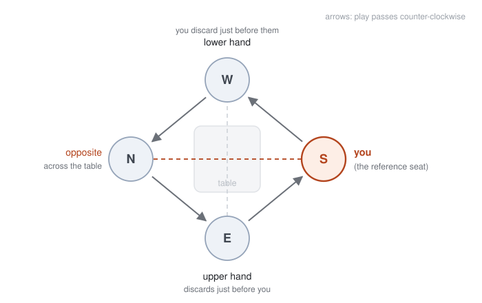
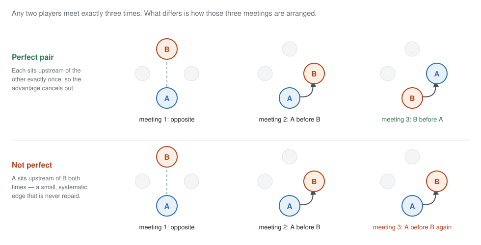
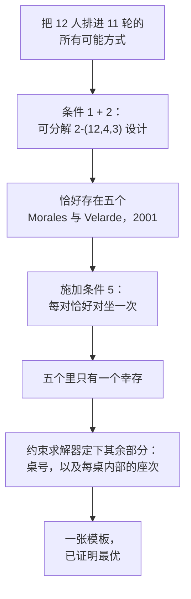
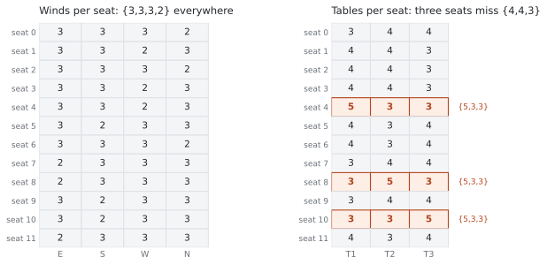
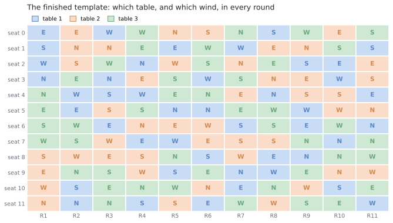

# 座位表是怎么来的

> [English](seating-design.md) · 简体中文

十二位选手，十一轮，三张四人桌。这一页讲这张座位表的来历：我们希望它具备什么性质，其中哪几条被证明在数学上不可能做到，剩下的搜索空间如何被压缩到屈指可数的几个候选并求解到可证最优，以及一张已经「最优」的表为什么仍然必须靠抽签发下去。

不需要数学背景。文末列出了论证所依据的已发表结果。

## 一张公平的座位表应该是什么样

麻将桌上的四个座位并不等价。出牌按逆时针经过东、南、西、北，每个座位与其余三家处在三种不同的关系中。

*真正起作用的三种关系。你的**上家**在你摸牌之前打牌——立直麻将里，只有他的牌你可以吃。你的**下家**反过来享有同样的便利，代价由你承担。你的**对家**在桌子另一头，既不喂你也不被你喂。*

东家还要坐庄，而坐庄是有价值的：庄家得分更多、付出更多，且和牌连庄。所以座位不只是一个位置，它是一份小而持续的优势或劣势，在十一轮里反复出现。

有了这个认识，下面是这张表当初被设计时对照的愿望清单。第一条是赛制的描述，其余五条是公平性目标。

1. **赛制。** 每一轮把十二人分到三张四人桌，座次按逆时针 东 → 南 → 西 → 北。
2. **每个人和每个人对局的次数相同。** 任意两人恰好同桌三次。没有谁抽到比别人更难或更易的对手表。
3. **风位平均分配。** 每人的十一局在四个风位之间尽可能均匀地分开。十一除不尽四，所以能做到的最好是 3-3-3-2，而且每个人都应该正好是这个分布。
4. **桌子平均分配。** 三张实体桌同理——可能一张靠窗，一张是自动桌，一张紧挨着门。十一除以三得 4-4-3，每个人都应该正好是这个分布。
5. **每个人和每个人对坐一次。** 任意两人在整届赛事中恰好对坐一次。
6. **每一对关系都是平衡的。** 对任意一对选手，他们的三次相遇应当由一次对坐、一次前者在上家、一次后者在上家构成。这样谁也不会整届比赛系统性地喂另一个人。

这份愿望清单背后的算术出奇地整齐，而这正是整件事值得做的原因。十二人共有 66 对。每一轮产生 18 个配对（每桌六个，三桌），十一轮产生 198 个——正好是 66 × 3。所以「每对三次」不是我们挑出来的目标，它是唯一可行的均分方式，而十一恰好是达成它所需的轮数。同样的巧合在第 5 条上再次出现：每一轮产生六组对坐，十一轮产生 66 组——恰好每对一次，不多不少。

第 6 条最值得展开，因为它最不直观，也最有价值。

*两位选手相遇三次。如果其中一次是对坐，另外两次方向相反，这一对就是**完美**的——上家位置带来的那点微小优势，两人各得一次。如果两次相邻相遇方向相同，那么其中一人整届比赛都在另一人的上家。*

## 两条说「不」的定理

组合学里的愿望清单常有崩塌的习惯，这六条里有两条被证明无法实现——不是「难找」，而是可证不存在。

第 2 条和第 5 条放在一起，描述的是赛程设计者研究了一个多世纪的对象：**惠斯特赛程**。惠斯特牌里对坐的两人是搭档，经典要求是每对搭档恰好一次、对抗恰好两次——这正是我们的第 2 条和第 5 条。十二人惠斯特赛程 Wh(12) 是存在的。

再加上第 6 条的理想形态——全部 66 对都平衡——这个对象就变成**有向**惠斯特赛程 DWh(12)，其中每个有序对恰好出现一次、一方是另一方的上家。2003 年，Haanpää 与 Östergård 通过穷尽计算机搜索完成了十二人以内惠斯特赛程的分类，其结论之一是：**DWh(12) 不存在**。第 6 条无法被任何赛程完整满足。

第二处崩塌是第 4 条。第 2 条与第 4 条合在一起——每对相遇三次*并且*每人拿到三张桌子的 4-4-3 分布——描述的是广义平衡赛程设计 GBTD(4,3)。这个对象同样已被穷尽搜索证明不存在。

所以六个目标里有两个必须放宽，而放宽的方式由定理决定，不由方便决定：

- **第 6 条**改为：最大化完美配对的数量。
- **第 4 条**改为：让每人的桌次分布尽可能接近 4-4-3，并最小化总缺口。

第 1、2、3、5 条保持精确。它们没有任何一处需要让步。

## 五个候选，然后只剩一个

即便放宽之后，搜索空间仍然大到无法直接进攻。单独一轮是把十二人分成三桌的一种方式，这样的分法有 5,775 种；一个赛程是十一个这样的分法叠起来，还要满足上述全部条件。暴力枚举毫无希望。

两项已发表的分类结果几乎把这个空间完全压掉了。

第 1 条与第 2 条合起来说的是：赛程的*分组*——谁和谁同桌，忽略座次与桌号——构成所谓可分解 2-(12,4,3) 设计。2001 年 Morales 与 Velarde 用穷尽回溯搜索证明，在选手重新编号的意义下，**恰好存在五个这样的设计**，并把五个都印了出来。这就把「搜索一个天文数字的空间」变成了「检查五个候选」。

我们随后对这五个逐一施加第 5 条：这个设计能否被补全，使得每一对恰好对坐一次？其中四个的答案是干脆的「不能」——不是「我们没找到办法」，而是求解器证明了不存在办法。五个里只有一个幸存。这与惠斯特分类完全吻合：Haanpää 与 Östergård 发现恰好存在两个互不同构的 Wh(12)，并指出两者建立在同一个底层设计之上。所以我们这张表的骨架根本不是一个选择——它是被迫的。

这里有一根刺。五个设计里有三个在第 4 条上其实能做得更好——它们允许只有*一位*选手拿不到理想的 4-4-3。但这三个都属于那四个根本无法满足第 5 条的设计。桌次平衡得最好的设计，恰恰是无法让每个人都有独一无二的对家的那几个，所以那个更好的桌次平衡够不着。

## 求解器定下了什么

设计被迫定之后，还剩两个决定：每一轮每组四人去哪张实体桌，以及他们到了之后如何排成东南西北。前者决定第 4 条，后者决定第 3 条和第 6 条。

两者都交给了约束求解器。这里要紧的是：这类求解器不只是返回一个好答案——它返回答案的同时给出「不存在更好解」的证明，办法是把自己的上界和下界逼到相遇。两个问题都是这样收敛的：

- **第 3 条**精确达成：十二个座位每一个都拿到 3-3-3-2 的风位分布。
- **第 4 条**以最小可能的幅度落空：九个座位拿到理想的 4-4-3，三个是 5-3-3。
- **第 6 条**达到 66 对中的 55 对完美——在其余条件之下，这是上限。

*左：风位平衡，每个座位都完美。右：桌次平衡，三个座位落在 5-3-3。这道缺口就是那条不可能性定理留下的可见残迹——世上没有任何赛程能避开它。*

有一个恰到好处的巧合让结果比它本可能的样子更干净：桌号决定和座次决定不共享任何变量。改变某组人在哪张桌子打，不会影响任何人的风位，也不会影响任何人的上下家关系，反之亦然。于是两个最优解可以在同一张表里同时达到，也就没有什么优先级需要争论——下面这张表在第 4 条上是可得的最优，在第 6 条上同时也是可得的最优。

*最终的模板。每一行是赛程中十二个座位之一——此时还不是某个人——每一列是一轮。颜色表示桌子，字母表示风位。*

## 为什么这张表仍然需要抽签

模板是最优的，但它不对称，而这正是需要抽签的全部理由。

它十二个位置里有三个拿的是 5-3-3 而不是 4-4-3。66 对里有十一对不平衡，意味着其中一人整届比赛都在另一人的上家。这些瑕疵去不掉——上面的定理堵死了这条路——但它们可以被**不偏不倚地分配出去**。换句话说：这张表决定了十二个位置各是什么样，而必须由别的东西来决定谁坐进哪一个。

把十二个人分配到十二个模板位置上，有 479,001,600 种方式。挑出其中一种是仅剩的决定，而它应当具备五条性质：

- **均匀。** 每种分配等概率；谁拿到 5-3-3 的机会都不比别人高。
- **不可预测。** 在结果发生之前没人知道结果。
- **不可操纵。** 任何参与者都无法左右它——办抽签的人同样不行。
- **可验证。** 结束之后，任何人都能重算一遍，确认没有被动过手脚。
- **无需信任。** 以上四条都不应该建立在「相信某个人是诚实的」之上。

最后两条排除了那些显而易见的做法。「组织者在家掷个骰子然后告诉大家」过不了可验证性。「组织者跑一个脚本」过不了无需信任——不是因为组织者可疑，而是因为一个依赖他良好行为的方案，对任何当时不在场的人都什么也证明不了。

## 会自己打开的信封

造出一份没有归属的随机性，自然的办法是让所有人一起出。每位选手挑一个小数字——0 到 255 之间任意数，生日或者幸运数字都行；把这些贡献合起来；合成的结果作为洗牌的种子。只要**有一份**贡献是真正不可预测的，结果对所有人就都不可预测——不需要多数。

这个性质成立并不要求谁手工提供真随机。每位选手的数字会在他自己的浏览器里，与浏览器自行生成的一个长随机值混合，进信封的是混合之后的结果。所以一个填了自己喜欢的数字的人，贡献的不可预测性和掷骰子的人一样，而且事后仍然能核对自己的数字确实在里面。下面说的信标值最后也会被折进来，所以这次抽签并不只依赖那十二个浏览器。

难点在时序。如果数字一个一个公布，最后那个人就能看到其余十一个，挑一个让结果落到他想要的地方。经典的补救是让所有人先把数字封进信封，等全部交齐之后再一起拆。这可行，但代价是多一轮交互——而且它留了一个口子：一个眼看形势不妙的参与者，可以干脆拒绝拆自己的信封。

这里采用的方案把两个问题一起消掉了，办法是把信封换成一种在预先宣布的时刻会自己打开的信封。

它依托一个叫 **drand** 的公共随机信标，由若干独立机构共同运营，按谁也控制不了的固定节奏发布新的不可预测值。时间锁加密（tlock）让任何人都能把一条消息封给*未来某个信标值*：消息在信标到达那一刻之后变得可读，在此之前读不出来。没有可以收买、传唤或者必须信任的持钥人——提前打开不是被禁止，而是做不到。

对选手来说这是一个动作：用你在俱乐部本来就在用的 Pantheon 账号登录，输一个数字，提交，关掉页面。没有什么需要回来看，没有什么需要开着，也没有第二轮要理解。此后的一切自动发生，做好的座位表会同时出现在这里和 Pantheon 里。

上面要求的那些性质随之成立。没有人能操纵抽签，因为在任何人提交的那一刻，其余每一份提交都还封着——挑一个有利数字所需要的信息此时尚不存在，对任何人都不存在，包括组织者。没有人能拖住它，因为「打开」不是任何参与者执行的动作。整件事事后可查：封好的信封、打开它们的信标值、洗牌的代码和模板全部公开，所以任何参与者都可以把计算重做一遍，确认发到手里的表就是这些输入应该产生的表。

两点实务说明。十二人中至少八人提交，抽签即开——因为一份诚实的贡献已经足以让结果不可预测，而等一个迟到的人只会把拖住整届比赛的权力交给一个人。而一个始终没有提交的人，是对一个当时谁也看不见的结果弃权了——那是缺席，不是手段。

## 附录：模板

行是轮次，表项是模板位置 0–11，抽签把它们分配给人。每张桌子内部的四列依次是东、南、西、北。

| 轮次 | 一桌东 | 一桌南 | 一桌西 | 一桌北 | 二桌东 | 二桌南 | 二桌西 | 二桌北 | 三桌东 | 三桌南 | 三桌西 | 三桌北 |
|---|---|---|---|---|---|---|---|---|---|---|---|---|
| 1 | 0 | 1 | 2 | 3 | 9 | 8 | 10 | 11 | 5 | 6 | 7 | 4 |
| 2 | 5 | 10 | 4 | 11 | 0 | 2 | 8 | 1 | 3 | 7 | 6 | 9 |
| 3 | 6 | 4 | 0 | 3 | 8 | 5 | 7 | 1 | 10 | 9 | 2 | 11 |
| 4 | 7 | 11 | 4 | 2 | 3 | 8 | 9 | 6 | 1 | 5 | 0 | 10 |
| 5 | 1 | 9 | 7 | 5 | 6 | 11 | 2 | 0 | 4 | 3 | 10 | 8 |
| 6 | 11 | 8 | 3 | 5 | 7 | 0 | 6 | 10 | 9 | 2 | 1 | 4 |
| 7 | 10 | 6 | 1 | 9 | 4 | 7 | 8 | 2 | 5 | 3 | 11 | 0 |
| 8 | 8 | 0 | 9 | 4 | 1 | 7 | 11 | 3 | 2 | 6 | 5 | 10 |
| 9 | 6 | 2 | 5 | 8 | 3 | 4 | 10 | 1 | 9 | 11 | 0 | 7 |
| 10 | 2 | 10 | 3 | 7 | 0 | 4 | 5 | 9 | 11 | 1 | 6 | 8 |
| 11 | 4 | 1 | 11 | 6 | 2 | 3 | 9 | 5 | 10 | 0 | 8 | 7 |

## 参考文献

- L. B. Morales and C. Velarde, *A complete classification of (12,4,3)-RBIBDs*, Journal of Combinatorial Designs **9** (2001), 385–400. 确立恰好存在五个这样的设计，并列出全部五个。
- H. Haanpää and P. R. J. Östergård, *Classification of whist tournaments with up to 12 players*, Discrete Applied Mathematics **129** (2003), 399–407. 确立恰好存在两个 Wh(12)、两者共享同一个底层设计，以及 DWh(12) 不存在。
- *Generalized Balanced Tournament Designs with Block Size Four*, Electronic Journal of Combinatorics **20**(2) (2013), #P51. 以穷尽搜索确立 GBTD(4,3) 不存在。
